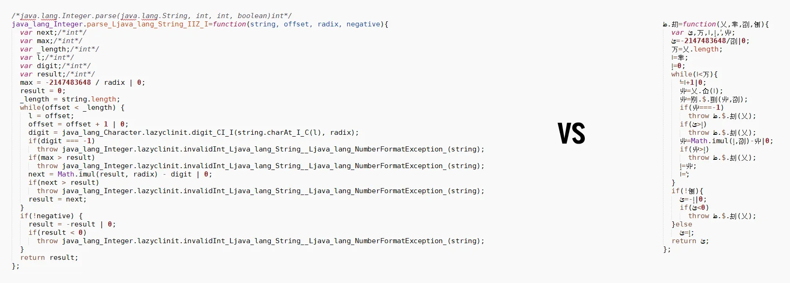

There are many different kinds of bugs. There are the simple ones: you see the error message, facepalm yourself and fix it. There are the hard ones. Different components of a complex software interact with each other in unforeseen ways and some good debugging love is required.

Of course there are even harder bugs once concurrency joins the party, debugging becomes a nightmare or reproducing the bug is complicated. Everytime I try to find some concealed bug, I try to ask myself what could go wrong and look at the code before I use the debugger.

Sometimes you can fix a really hard bug by trying to reason about the code, rather than stepping through it. We had a bug in our register allocator once and the best way to fix it was to write the algorithm down on paper and to figure out what is going on.

Last but not least there is the [Heisenbug](http://en.wikipedia.org/wiki/Heisenbug). The most diabolic bug. Once you start trying to understand its behaviour, it disappears and is no longer present. The system changes its state as you start to observe it. Those bugs are really hard to track down. Especially when the code looks so inconspicuous.

```js
function toInt(value, radix) {
  return value / radix | 0;
}
```

_What could possibly go wrong?_ We have to start from the beginning in order to understand how it took me three days of debugging, building V8 from source and why this is an actual Heisenbug.

## Where do these Exceptions come from?
[We build a compiler](https://www.defrac.com/) with a Java bytecode frontend and various backends, one being JavaScript. Our compiler is lazy in the same way a Java Virtual Machine evaluates and verifies bytecode. You may have a method referencing a class that isn't present at runtime. If that method is never called, you’ll never get the ClassNotFoundException. The same applies to our compiler. One could say its various phases, abstract interpretation and platform agnostic type system is already quite complex. Therefore I am always looking for a mistake in our system first. The web backend contains more than 35 compiler phases, excluding the optimizer pipeline. Plenty of stuff that can go wrong.

> Invalid int: “15”

One day I was presented with a NumberFormatException inside an application that did run fine otherwise. The message was odd. It said that 15 is an invalid integer. I reloaded the app and it worked fine. Nothing to worry about. Maybe an old error I introduced somewhere and the JavaScript file was cached. I am running Ubuntu and the Chrome developer channel. I am used to odd behaviour and got other things on my plate that day.

The bug disappeared and I didn't experience it again. For a while.

## Faster, Faster

Building a compiler means you are out for a long lasting quest. The ultimate goal: maximum performance. Our JavaScript backend makes a tradeoff between code size and performance. You could achieve a smaller footprint if you accept a certain performance hit. We tried this for instance with keywords like null, true and false. Binding them to global single-character variables reduces code size but comes with a 20% performance hit in the [benchmarks](https://github.com/defrac/platform-benchmark).

Renaming has the biggest impact on code size. Simply speaking, every name in a Java class needs to be fully qualified to resolve in JavaScript. Here is an example:

```java
class Foo {
  public int value;
}

class Bar extends Foo {
  public int value;
}

void set(Bar bar) {
  bar.value = 123;
}

int get(Foo foo) {
  return foo.value;
}

void main(String[] args) {
  Bar bar = new Bar();
  set(bar);
  System.out.println(get(bar));
}
```

What does it print? The result will be 0, since Foo::value is not Bar::value. How do we model this behaviour when emitting JavaScript? We can't simply generate “this.value” since it’s ambiguous. One of our last phases resolves all names so that they become unique. In fact we'd probably emit code like “bar.Bar_value = 123” and “return foo.Foo_value” for the getter and setter function.

Minification plays an important role. Of course, assigning names could be done much smarter but it’s a time consuming task once you start thinking about it. In fact it is so complicated that we won’t do it by default.

The first minifier we wrote followed a simple algorithm. Use any valid identifier-start character and continue with all possible identifier-part characters. The first name we'd encounter would become “a”, the next “b” and so on until we reach “Z”. The next name would be “aa”, “ab” et cetera. What’s the problem with this algorithm?

First of all we could count the occurrences of a name in the whole program and assign it the shortest sequence as a heuristic. But even worse, what if we generate a name like “abs”, “sqrt” or “sin”? Programs are large enough so that we create names that start clashing with JavaScript APIs. defrac allows developers to extend native classes with custom functions and properties. In that case we could create a conflict. The first solution was to choose a prefix that isn't used in the APIs, like _ or $. Now all of our variables are named “_a” and so on. I didn't like this for various reasons. Other JavaScript frameworks could define their own properties, JavaScript developers could define their own properties and the whole interop layer becomes unstable as a result. Also if we start to use an extra byte, isn't there a better solution?

Unicode. (Wow, I couldn't believe I actually write that some day)

> An identifier must start with $, _, or any character in the Unicode categories “Uppercase letter (Lu)”, “Lowercase letter (Ll)”, “Titlecase letter (Lt)”, “Modifier letter (Lm)”, “Other letter (Lo)”, or“Letter number (Nl)”.
> 
> The rest of the string can contain the same characters, plus any U+200C zero width non-joiner characters, U+200D zero width joiner characters, and characters in the Unicode categories “Non-spacing mark (Mn)”, “Spacing combining mark (Mc)”, “Decimal digit number (Nd)”, or “Connector punctuation (Pc)”.

I started generating Unicode characters for our identifiers. They are only one character, but still two (or more!) bytes — no reduction in file size.

On the other hand V8 is a very complicated piece of software with all different kinds of heuristics and tricks to make JavaScript code fly. One is lazy compilation. And one heuristic when to inline a method is based on the number of characters it contains. Why the characters? Sounds stupid at first. But if you never generated the AST, what else could you use as a heuristic?
In V8 terms, “_a” is two characters whereas “ツ” is only one character. Pretty cool, huh? Due to our change in the minifier, we're able to trick V8 into optimizing more code. And that’s exactly when the exceptions started to show up. Only I didn't know. And I didn't notice at that time.

## “Tobias isn't able to start Audiotool anymore!”
[Audiotool](https://www.audiotool.com/) is rebuilding their application with defrac. One morning André Michelle came to me and told me that someone from the office wasn't able to launch Audiotool anymore. On a Mac. With a beta version of Chrome.

I got interested and went to Tobias, asking what happened. There it was.

> Illegal int: “251”

I immediately remembered the message from about a month ago. But this time it was the beta version of Chrome on a normal operating system. I tried to reproduce it on my system and loaded the HTML5 app. It presented me with “Illegal int: 16”. I reloaded, “Illegal int: 251”, again, “Illegal int: 134”. Why are those numbers so random? Usually, I'd expect it to fail with the same message and besides: 16, 251 and 134 are not illegal integers!

## Backpropagation
Artificial neural networks learn with a technique called backpropagation. You present them with the desired output for a given input and propagate the weights of the synapses backwards throughout the layers of the network. I like to think of my way of tracking down bugs the same way. Audiotool is a large piece of software with more than 500kloc on the client. The JavaScript file we generate is approx. 2.5MB, minified. Obviously the first idea is to start from the generated code where the exception is thrown, backwards to the initial code triggering the issue.

This already happened a couple of times. We didn’t obey the JVM semantics quite right in the early days and saw some rendering glitches. The reason was that some totally unrelated code generated an invalid value that propagated into the rendering system. Those bugs are not easy to find. A stack-trace doesn't really help.

So I started looking at the implementation of [Integer.parseInt](https://android.googlesource.com/platform/libcore.git/+/android-4.2.2_r1/luni/src/main/java/java/lang/Integer.java); that’s the one that throws. Nothing suspicious. I built a small example app and tried parsing some integers. It worked. So if this code is correct, something else must be broken. As I said, Audiotool is quite big and the minified code contains all kinds of meaningless characters, no spaces and line breaks. I cloned the repo and created a debug build with defrac. Eager to understand what was happening I started the app — but I didn't get the exception anymore.

## Searching for a culprit
Now there is an obvious difference. “web:config debug true” and the exception is gone. “web:config debug false” and it appears again. Each time with different value which is in fact a valid integer.

Let’s do a usage search for the the debug setting in the compiler.

- Disable line-breaks and spaces when debug is false
- Rename symbols (variables, classes, …) when debug is false
- Output type information in comments when debug is true
- Platform.debug() returns this value at runtime
- …



Of course, renaming symbols was the most promising since I changed it just a couple of weeks ago. I reverted my change and voilà! No exception.

I thought I generated wrong names that are not ECMA-compliant. After reasoning about the code I couldn't figure out what was wrong and eval()’d all possible names. No issue. If the names are correct, is something else causing the issue? Maybe a space is missing somewhere? When debug is false, we only generate the space characters that are absolutely required or allow us to trade two “()” characters. “x instanceof y” is such a case. I re-enabled the unicode names, emit all line-breaks and spaces. No exception. Not emitting the unnecessary spaces didn't change anything. What’s left? It must have to do with the line-breaks. Wow!

I started looking for cases where we emit semicolons. How could line-breaks affect the code? When semicolons are being omitted. That was my theory at least. I made sure all semicolons were emitted and disabled the line breaks. I get the exception. No matter what I do with the semicolons, I get this exception.

I reached the point where reasoning about the code isn't getting me anywhere. I opened the developer tools in Chrome and tried all different configurations. Even no line-breaks and the unicode names. No exception, nada.

At that point I thought I hit a wall and I am running in the wrong direction There is this moment at which you think that a friendly quantum entanglement with a different universe is causing perfectly valid code to fail — or line-breaks. In hindsight, I should have already know where to look at this point.

Next day. A fresh start. If the debug setting has no effect when a debugger is attached, something else must be wrong. Backpropagating.

1. Exception about an invalid integer is thrown
2. Integer is being parsed
3. Audiotool model is constructed
4. JSON format is being parsed
5. Network response is being received and parsed
6. Network request is made to load current session
7. Audiotool starts

I tried to take a look at all high-level components provided by defrac. The exception happened in my code about a month ago too. Therefore I should look at steps 1, 2, 4, 5 and 6. In such a situation, I try to isolate the components and test them individually. Lucky for me, parsing the integer was the easiest to test first.

I implemented the integer parsing in JavaScript and this is the part where the exception occurs:

```js
while(offset < length) {
  var digit = todigit(str.charCodeAt(offset),radix);
  offset = offset+1|0;
  if(digit == -1) throw invalidInt(str);
  if(max > result) throw invalidInt(str);
  var next = Math.imul(result,radix)-digit|0;
  if(next > result) throw invalidInt(str);
  result = next;
}
```

It has nothing to do with the issue. But it was crucial in finding it. Running my test parser in a loop revealed the “Invalid int: 3678” message, each time roughly after 5000 iterations. Then it hit me. I wasn't able to reproduce the issue with a debugger attached , the exception happens “randomly” and the isolated cases makes it crash roughly around the same number of iterations.

**This is the freakin’ JIT!**

## How a VM works
Think about a virtual machine like an orchestra. Each musician, highly skilled, playing their part. If everybody does the job right, we hear a beautiful symphony. The garbage collector, the just-in-time compiler, the runtime and so on. It isn’t easy to manage a set of skilled musicians and it isn’t easy to create a virtual machine that compiles code down to the metal while still being able to debug it. The Flash Player was an example of the contrary. There were two different binaries. One with debugging enabled (the Debug Player) and one with debugging disabled (the Release Player). The Debug Player was running code so painfully slow that debugging apps was no fun. Why? Because it always acted like all methods are actively been debugged. The orchestra went from 110bpm to 60bpm so that you can hear each note individually. Just because there is this one chord you don't understand.

Modern VMs do it different. They figure out when a debugger is being attached, maybe when the method is invoked or on each iteration of a loop, and switch from compiled to interpreted mode — simply speaking, since V8 never interprets code. But V8 will drop out of crankshaft/hydrogen if you attach a debugger.

Because complex optimizations are costly, VMs try to identify code that is used often, also called hot code. Hence the name HotSpot. When the VM identifies such a hot spot, it will shoot with everything it got to make this method perform super fast. Think about this loop:

```js
var x = 0
while(x < 10000) {
 doSomething()
 x++
}
```

The VM will execute a slightly different version. Here is some pseudo-code:

```js
let x = 0.0
var loop_iterations = 0
while(true) {
  var condition = vm_runtime::toDouble(x) < 10000.0
  if(!condition) {
    break
  }
   if(++loop_iterations > LOOP_OSR_THRESHOLD) {
    // loop is a hot-spot, optimize!
    vm_runtime::performOSR()
  }
  doSomething();
  x = vm_runtime::toDouble(x) + 1.0;
}
```

When vm_runtime::performOSR() is invoked, this loop might be replaced with a more optimized version that could get rid of the double checks since a JIT can prove x is always an integer less than 10000 — something V8 will do.

Of course the VM will also keep track of how often “doSomething()” is invoked. If it reaches a certain threshold, it is considered a hot spot and also a worthy candidate for costly optimizations.

In order to validate my theory I simply had to check when the function executes and if it gets optimized by V8. If the exception is thrown after the code gets optimized I know I can file a bug report.

## End of the Line
I already had the latest V8 sources on my machine since I run our benchmarks using D8. This is a simple shell application that executes JavaScript in a REPL. It is great for debugging performance problems, unit testing and I use it often to quickly test some JavaScript. D8 also has this great option:

```
--trace_codegen
```

When you run the sample code with that option, you'll get output like this:

```
3856
3855
3854
3853
[generating full code for user-defined function: ]
[generating optimized code for user-defined function: ]
[generating full code for user-defined function: ScriptNameOrSourceURL]
[generating optimized code for user-defined function: ToBooleanStub]
[generating full code for user-defined function: GetLineNumber]
[generating full code for user-defined function: ScriptLocationFromPosition]
[generating full code for user-defined function: ScriptLineFromPosition]
[generating full code for user-defined function: charAt]
[generating full code for user-defined function: SourceLocation]
/home/joa/Desktop/bug.js:2: Invalid int: 3852
```

What a relief. I filed the [report](https://code.google.com/p/v8/issues/detail?id=3865) and it got [fixed](https://codereview.chromium.org/897263002/diff/20001/src/hydrogen-instructions.cc) in no time. In fact you can see that the regression test is much simpler. And it’s quite scary.

## The Aftermath
Could I have spotted this earlier? I think so. My first mistake was ignoring the very first time the exception was thrown. It would have been much easier to find it back then.

The second clue was the fact that I didn't get the exception when the debugger was attached. There isn't much in the JavaScript code that could cause such issues and it is most certainly VM related.

I also wonder if I should have started testing the code in a different browser earlier. Indeed it worked in Firefox. But sometimes this doesn't mean anything. Chrome and Firefox are not in sync, API-wise. And with the vast amount of JavaScript code being executed one can usually assume the VM isn't the culprit. This makes debugging so hard because you really don't know where to look and when looking for a mistake, the best place to start is with yourself.

Thanks to [@mraleph](https://twitter.com/mraleph) for proofreading this article. Go checkout his [blog](http://mrale.ph/) if you are interested in actual V8/dart internals.