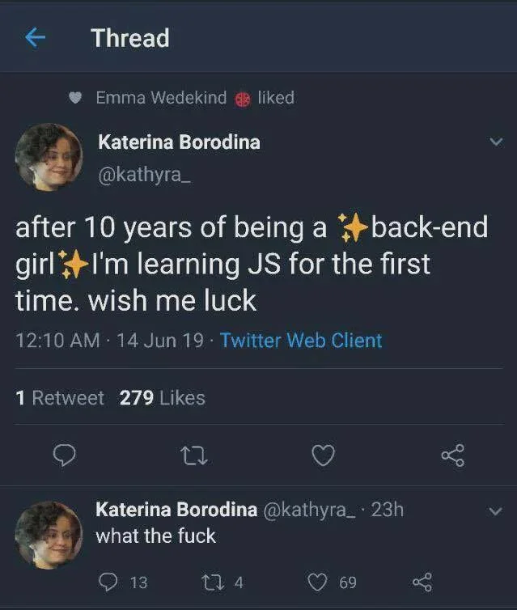
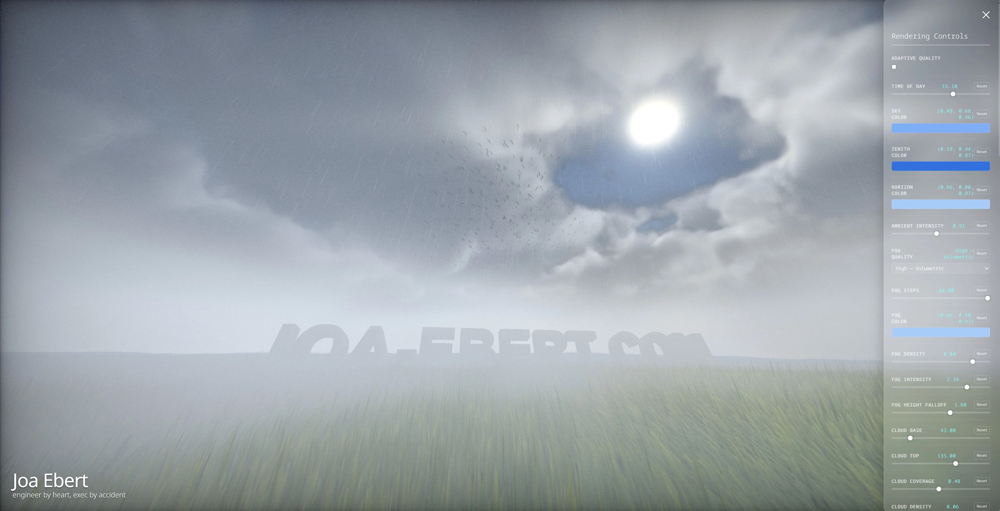

It's been a while. In fact. It's been a really long time. Welcome back!

You may wonder what happened. Life, I guess. Kids. House. Garden. Injury. Work. A lot of work.

And _writer's block_.

> But you are not a writer!

Correct. That's true. I guess I just put myself under a lot of pressure. Everything had to be perfect.
If it is not a true epiphany, it is not worth writing about it. If performance does not improve by 10x,
it is not worth writing about. If the project is not done: don't write about it. Abstract meta topics?
I don't want to sound like a LinkedIn thought leader lunatic. I once finished a talk at a tech conference
to a standing ovation. A true goosebumps moment for me. But nothing was ever good enough
and I wrongly tried to chase that feeling with the next big thing. Forcing success became a recipe for failure.

And then I drifted away and started to write about weird topics. But just for me, apparently.
I accumulated approximately 40 unfinished drafts in my WordPress database on my old blog.
Posts about how spreading your butter on a slice of bread has a relation to the code
you write — very German, I know. And while I think it is absurd and a bit funny, 
I still believe there's at least some truth to it[^1].

So how do we end up here on this new blog?

## Saying Hello to an Old Friend

Back in 2005, this rendering was my website header. It was all Cinema4D and a bit of Photoshop.
The idea of making this an actual realtime rendering never left me.

So I started building. Without corporate guard rails. Without a big vision or architecture.
Just me and the meadows...and Claude. Of course. I would not have done shit without the help of AI. 

The time it takes to build something nowadays is overwhelming when you want to achieve anything
remotely ambitious. Luckily frontend tooling has much improved over the past years and has stabilized.
Hence I thought it's a good time to give it another try.

I am really not interested in some random person's _opinionated_ framework and choices that will be invalidated in the next couple of months. 
And now, AI gives me the freedom to be fully ignorant of all the yak shaving. I love it.
I can focus on what matters to me and do _what I want_. The ceremony around it can be done without me.
Though that ignorance does have a limit. The JavaScript is something I want to build and want to understand completely.
The difference is I got to choose where to spend the time and understanding.
Maybe that's just me getting older. But I don't want to waste my free time on some wild goose chases that have literally no positive impact on my life[^2].
The tradeoff is that I have little to no knowledge about things like the Python script<ext-link href="https://github.com/joa/website/blob/master/scripts/subset-fonts.py"></ext-link>
that produces a subset of the Noto Sans font used on this website. This is not production code however. It is my playground.
Like with technical debt, you need to know where you buried your skeletons.

That's also the reason why this website is built using a relatively simple stack, with as little dependencies as possible.
In fact, there are zero runtime dependencies aside from [KaTeX](https://katex.org/) for math rendering.
I use primarily Tailwind, Vite, and Hugo to build this site.

Everything else is plain JavaScript and ~~WebGL2~~ WebGPU[^3]. You may ask why not TypeScript, or why not Three.js. Fair.
The codebase is small. I get no real benefit. So why bother? For me, part of the fun was building all of this. Not pleasing
a type system. Which is also why I did not bother using Three.js. I simply wanted to have the joy of building from scratch,
knowing full well that a great framework already exists. L'art pour l'art motherfuckers.

OK. I am using Tailwind. Mea culpa and I will probably regret this in the future.
I wanted to learn it, so I used it. Simple as that. I have basically no interaction with frontend development
at work so this is me staying informed and up to date.

## Touching Grass

So here we are. I now live with my family at the edge of the Teutoburger Forest. 

I started to do Triathlon and focus more on my health. It's nice to get outside sometimes, you know. 

When I was 25 years old, I had the agreement with my wife that every Tuesday and Thursday she would not wait
for me and I could work until 3AM, or even later.

I also had regular terrible migraines during that time. If only I could guess why. In hindsight it is obvious and honestly embarrassing how stupid I was.

My plan is to play around on this website and continue to extend the interactive rendering.
It is my digital playground. If you expand it to fullscreen, you get access to a whole set of controls that you can modify.

Furthermore, I always wanted to play around with control theory for rendering. The website adjusts its quality automatically to _hopefully_ achieve 60fps on your device.

There are birds flying around.
There's the sun and moon cycle.
Even though there is literally only one light source (the sun), I added deferred rendering and some fireflies to justify it.
The camera is moving slightly based on pre-baked constants derived from my own biometric data.
It's the little details that I like. 
It rains a lot in Bielefeld, so there's a high chance it will rain on the header.
But you may also spot a rainbow.

All of this was built with the help of AI. The written content is a different story.

## The use of AI on this Website

Let me be clear: what you're reading on this website has not been written by AI and never will be. Feel free to have a look at
the CLAUDE.md<ext-link href="https://github.com/joa/website/blob/master/content/CLAUDE.md"></ext-link> file I am using.

I **do** want to make sure my text reads well without errors. I also don't want to end in a "trust me bro" situation.

AI is used to check spelling and ensure good flow. I also use it to question statements I make, which 
incentivizes me to dig deeper and look for references.

I recovered some of the old content from LinkedIn or Medium and added it here without modifications.

As for the new content, I guess I'll have to write about spreading butter on bread now.

[^1]: I lost all my old content, but this is still a topic I want to explore in the future. Seriously. It's about optimization targets.
[^2]: I am just not interested in debugging OS-level incompatibilities anymore when I just want to get some work done.
[^3]: I built everything as a WebGL2 renderer and then thought it would be cool to use compute shaders; so obviously I converted everything to WebGPU and spent a lot of time
      fighting compatibility issues and performance degradations to then not even use compute shaders.