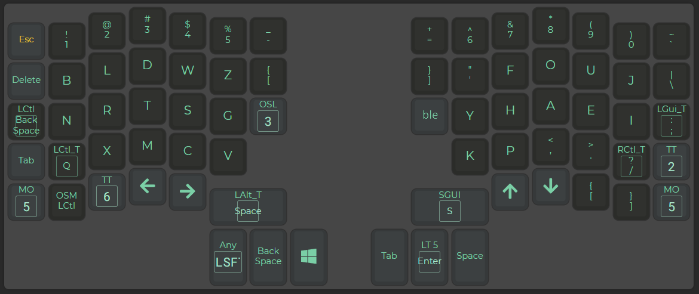
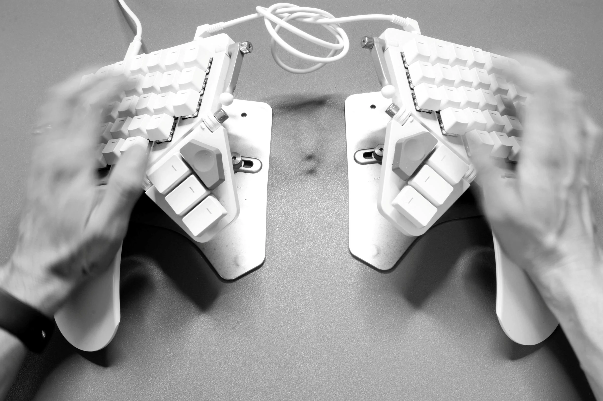
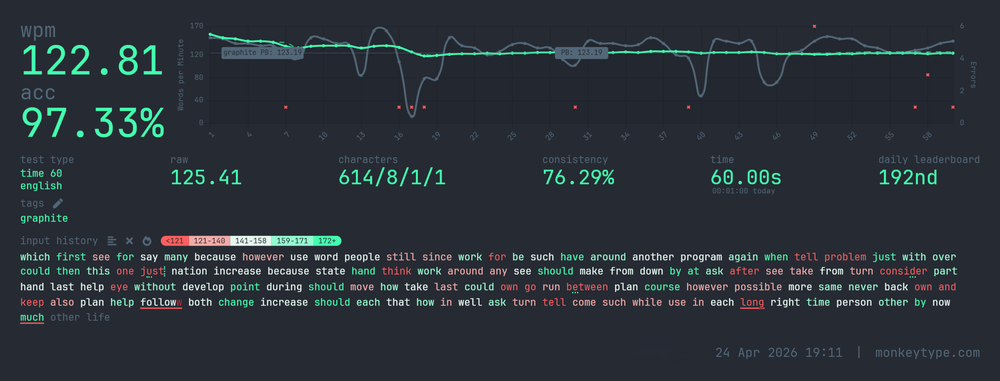

At 38, after I spent literally decades typing on QWERTY in pain, I decided to switch to a split keyboard with a new layout and relearn to type. It was agonizing. It was slow. It was worth it! 

I developed a serious overuse strain over the years. It was most apparent to me when I had a mild bike accident in 2015 in Cologne, or when I did a lot of work in the garden, or when I played Padel. A light impact on my hand sometimes caused severe pain that lasted for weeks. This became unbearable for me.

Initially I bought a vertical mouse and talked to at least three doctors. I got some exercises to mitigate the issue but nothing was really helping. As engineers, we like to do RCA. And what good is it to perform some exercises when you still cripple your joints every day by sitting in a completely unnatural position? Personally I thought that I needed to change my posture.

When we moved into our house and I set up my office, I already got me a standing desk. I am an avid user of the HAG Capisco<ext-link href="https://store.flokk.com/global/en-gb/products/hag-capisco"></ext-link> chair and I never had issues with my back (...so far). Only the constant sitting probably contributed to the shortening of some key muscles which is another price I have to pay currently. 

I always knew about the Kinesis Advantage, and the urban myths about how Dvorak was a superior typing layout and how QWERTY was invented to stop typewriters from jamming (both of which turn out to be at best oversimplified[^1]). 

Five years after the mouse and desk change, when I was still experiencing the same pain, I went shopping for a new keyboard. And a new keyboard layout.

## Split Keyboards

<figure>
{}
  <figcaption>
Typing Moby Dick at 80 wpm on different keyboards with inverse kinematics. The <em>units travelled</em> measures how far the artificial finger tips moved in total.
</figcaption>
</figure>

If you think about how you sit in front of your computer it becomes obvious that your hands make a weird turn to the keyboard, and sometimes you make another weird turn when picking up the mouse. Split keyboards allow you to place the hands naturally in front of you on the table, forming a straight line. Split keyboards with tenting allow you to go one step further and add an angle to the keyboard as if your hands were resting naturally on the table.

These were my requirements: I wanted an easy to use, programmable keyboard with a high build quality and tenting support. There are many options to choose from. My colleague always solders their own keyboards and they never buy them off the shelf. And if you fancy doing the electronics yourself plus a bit of 3D printing: there are infinite options. I, on the other hand, have a very simple goal: fix the pain and get on with it.

<figure>
  {}
  <figcaption>
Typical ISO keyboard with row staggering
</figcaption>
</figure>

Another feature of many split keyboards is that they are often not row-staggered. This means the keys line up in straight vertical columns instead of the slanted columns you trace on a staggered board. That’s very important when thinking about layouts later. And if you were to just keep typing with your normal layout, this already feels a bit different. Instead of the rows, split keyboards often stagger the columns to account for different finger lengths.

<figure>
  {}
  <figcaption>
Columnar staggered split keyboard; because our fingers have different lengths
</figcaption>
</figure>

I ended up going for the ZSA Moonlander and bought the tenting kit in addition. There are several features of this keyboard that I don’t care about, such as the RGB LEDs, but I am a happy customer. No issues. High quality. It got me started quickly thanks to being very user-friendly. The only downside is probably the price. But given we spend north of 1000h a year in front of our desks I think it’s still a no-brainer[^2].

## Programmable Keyboards

A very nice thing about ZSA is that they offer a web UI to flash layouts onto your keyboard. That’s right. These keyboards are programmable from your web browser. Pretty neat. They do run a fork of QMK as far as I know and let me tell you: QMK<ext-link href="https://qmk.fm/"></ext-link> is the goat of keyboard programming. 

I started with Oryx, ZSA’s web tool, and used it for probably a good year until I began to flash my own firmware onto the keyboard. 

Programmable keyboards, and software such as kmonad<ext-link href="https://github.com/kmonad/kmonad"></ext-link>, allow you to add layers to keyboards and they function exactly as you’d imagine. So, for example, the `W` key could also be the `Arrow Up` key if you press another key that brings you to another layer.

And with QMK, your keyboard can also be an actual mouse from the OS perspective. It can also be a MIDI step sequencer. It can autocorrect as you type based on whatever you just typed. It’s wild. 

Initially I started with two layers. One was a QWERTY layer and then I had another layer for the Colemak layout I tried to learn. I chose Colemak, more specifically Colemak-DH<ext-link href="https://colemakmods.github.io/mod-dh/"></ext-link>, because I read positive things about it and that it should be rather simple to learn if you’re used to QWERTY. It’s also one of the most popular alt-layouts.

## The Layout Rabbit Hole

Starting with Colemak I noticed the layout is suboptimal and that I am still moving my fingers and hands a lot more than I’d like to. This has led me down the rabbit hole of keyboard layouts: a fringe world where you have variants, dialects, interesting measurements and many, many options to choose from depending on what you want to optimize for. The optimization vector's dimension itself is quite large, let alone given the different hardware features `(split, splay, tent, column stagger, row stagger, ...)`. 

The _Keyboard Layouts doc_<ext-link href="https://docs.google.com/document/d/1W0jhfqJI2ueJ2FNseR4YAFpNfsUM-_FlREHbpNGmC2o"></ext-link> is an amazing resource for alternative layouts but it can also be overwhelming. It is, at least to my knowledge, still the best resource for different keyboard layouts and an explanation of what they optimize for.

### High Roller

Certain keyboard layouts try to be “a better QWERTY” and I would put Colemak into that category. These often try to keep the shortcuts such as `CTRL+{X,C,V}` at the known position. That’s not a bad thing per se. As alt-layouts became more popular and keyboard analyzers more powerful, people started to optimize for different targets such as high-roll count, less "scissor stretches"<ext-link href="https://getreuer.info/posts/keyboards/glossary/index.html#scissor"></ext-link> or more balanced use of both hands. Rolling means that you press for example three fingers, from the same hand outwards-to-inwards. 

> **Example**: pinky `t`, ring `h`, middle `e` would be a nice inward roll typing `the`. 

There are inward roll focused layouts, there are outward roll focused layouts. And then we have layouts that focus on alternation which got me interested. Ideally, I wanted to use both hands equally, yet have a high roll percentage. This decision was arbitrary. I could’ve picked something else entirely but it was appealing to me after I was not satisfied with Colemak.

## Graphite

I ended up picking the Graphite layout. First of all it was a layout that was in use by some people and that had at least some traction. It was a suggestion on the AKL Discord<ext-link href="https://discord.gg/2qq8qmDtFf"></ext-link> after I talked about my experience with Colemak and that I’d like to try Sturdy<ext-link href="https://oxey.dev/sturdy/"></ext-link>. The author of Sturdy pointed me to Graphite<ext-link href="https://github.com/rdavison/graphite-layout"></ext-link> which was a strong move as they said their layout had some issues and they were working on a newer version that wasn’t quite ready yet.

The Graphite intro reads:

> Graphite is a highly optimized, well balanced, general purpose keyboard layout designed to accommodate the real world needs of typists looking for a great “out-of-the-box” experience.  

This is spot on. 

The layout has a focus on high alternation and rolls with pretty good punctuation support. I created my own version with QMK for the Moonlander keyboard featuring a “magic” key. The idea is that you can press a key to complete the rest of the word, or to fill in same-finger-bigrams (SFBs) based on what you just typed. 

For example rdavison, Graphite's author, recognizes typing “physics” is less than ideal with their layout[^3]. Not as bad as typing `decade` on QWERTY (give it a try!) but still.

Normally you type right-index `p`, then right-index `h` and then right-index `y`. That’s three letters in a row with the same finger, making `phy` an SFT (same-finger-trigram). But as I mentioned earlier, QMK allows you to do pretty advanced setups. While shopping for an alt-layout I stumbled upon Magic Sturdy<ext-link href="https://github.com/Ikcelaks/keyboard_layouts/blob/main/magic_sturdy/magic_sturdy.md"></ext-link>. The idea goes like this: you know that `p` was pressed. And if you press _the magic key_ the keyboard can generate an `h` instead. That means the right-index can move to the `y` key in the meantime. My magic key is actually my `Shift` key. If I hold it, it’s like a normal `Shift` key. But if I just press it, it generates a different (set of) keystrokes based on what was pressed last. Oh, and it’s pressed by the left thumb making it not interfere with anything else.

You can check the layout at [https://github.com/joa/graphite](https://github.com/joa/graphite). It also comes with some other nifty features such as German umlaut handling, or OS-agnostic screenshot hotkey. The keyboard detects the OS at runtime and will send the proper shortcuts. I sometimes take my keyboard with me when I travel or drive to our Cologne HQ. Very convenient as I work on a Windows desktop (mostly in a Linux VM) but travel with a MacBook. The holy trifecta. 

I also made an Oryx version without the magic key. You can try it [here](https://configure.zsa.io/moonlander/layouts/GLeeV/latest/0/intro).

## Twelve Months of Suffering

Now. With the right hardware and software, the painful progress of learning a new keyboard layout began. 

I can tell you it was a pretty sad story. Initially I had QWERTY and Graphite coexist. When I needed to answer people quickly I switched the keyboard into QWERTY mode, and when I had some more time I typed using the Graphite layout.

But that wasn’t going anywhere so I started to look for resources to learn keyboard layouts and to swap the default to Graphite and basically stop using QWERTY. The average typing speed is approximately 52 words per minute (wpm)[^4]. As a reader of this blog and avid typer, you are probably somewhere in the 100s, like 110 wpm or 120 wpm. 

Typing is mostly muscle memory. You don’t think about where you’re moving your fingers. That memory needs to be rewired. I started learning the layout basics by using the [keybr.com](https://www.keybr.com/) website. It basically asks you to press letters repeatedly and grows the pool of letters once you hit them consistently. This was a great start. 

I also went with [ngram-type](https://ranelpadon.github.io/ngram-type/) and [KeyZen](https://adamgradzki.com/keyzen-mab/)[^5] early on. These provided enough of a baseline to start grinding higher wpm on [Monkeytype](https://www.monkeytype.com/). And, like with any instrument you practice: there’s no shortcut.

Every day I was allocating a portion of my time just typing the words. I used the 5k most common English words as my training corpus. In the first three months I achieved a consistent 60 wpm. That was huge as my very first weeks were more like 30 wpm. Then I made a good jump to 90 wpm that felt as if it came out of nowhere, followed by smooth progression to 100 wpm. This is when I started to hit diminishing returns. Getting higher wpm meant spending significantly more time. I started in July of 2023 to learn Graphite, recorded my first test on Monkeytype in October 2023 at 60 wpm and continued until July 2024, where I hit about 110 wpm on average. Monkeytype alone says I spent 17h on its tests. Add to that the time I spent in keybr, KeyZen and ngram-type and that’s totally fine in my book.



Given how much time we spend in front of the computer it was a worthwhile investment. I basically stopped using Monkeytype after I was happy with my 110 wpm and just did a test occasionally. At the end of 2025 the average score of my last ten tests was 117 wpm and I hit an ATH of 123 wpm on a 60-second test. Mission accomplished. But also the diminishing returns hit really hard as you can see. Aside from the typing practice, I also typed and programmed each day like I normally would.

## No Pain, No Gain?

I am pain-free now. Yay!

My switch to a split keyboard with a layout optimized for alternating hand use and less finger movement paid off – for me. Honestly, I suspect the split, column-staggered, tented hardware did most of the ergonomic heavy lifting; the layout switch was more about typing joy than wrist relief. Something I always wanted to do in life was learn a different keyboard layout. It was a weird side-quest of mine (yes, I have several of those). Liebowitz & Margolis[^1] argue there is no rigorous evidence any alt-layout meaningfully outperforms a trained QWERTY typist, and reading the paper I think they have a point. mythicalrocket sustains 231 wpm for an hour straight on QWERTY[^7]. Every body is different. Your mileage may vary. 

The keyboard set me back a good €500 and I would guess that I spent 24h of “active learning”[^6]. I am now typing with Graphite daily and got really used to it.

Another fun part was observing what happened to my brain. It’s now muscle memory and as I type these words I do not think about where each letter is. When you write something and you spend a good amount of time thinking about which key to press it becomes a lot more exhausting. I underestimated this mental tax initially and had to take pauses from writing.

On my split keyboard, I can no longer type QWERTY. Maybe it would come back after several hours but I don’t bother trying. On my laptop, a standard MacBook, I can only type QWERTY. I installed Graphite but I can’t type it on a staggered non-split keyboard. That’s why I sometimes travel with my keyboard nowadays.

On the other hand if I open up a typing test on my MacBook and I try to type fast, my body refuses to type QWERTY. It's as if my brain enters test mode, like a good Volkswagen Diesel, and I can only hammer out Graphite. 

There are really crazy folks who can actually change the layout for each word they type, like QWERTY, Dvorak, Colemak and then some other layout you have probably never heard of. Chapeau to all of you! 

If this post got you interested in split keyboards or alternate layouts, here is a list of resources I can recommend:

- [AKL Discord](https://discord.gg/2qq8qmDtFf): Very helpful folks
- [Keyboard Layouts doc](https://docs.google.com/document/d/1W0jhfqJI2ueJ2FNseR4YAFpNfsUM-_FlREHbpNGmC2o): Good resource on alt-layouts in general
- [Pascal Getreuer's website](https://getreuer.info/posts/keyboards/glossary/index.html): QMK contributor and very good background info
- [KeyZen](https://adamgradzki.com/keyzen-mab/): The best tool to get better at typing IMHO
- [keybr.com](https://www.keybr.com/): Useful to start locating letters
- [ngram-type](https://ranelpadon.github.io/ngram-type/): Useful to grind bi- and trigrams
- [problemwords](https://problemwords.com/): Focus on the words where you make the most mistakes
- [leveltype](https://github.com/christoofar/leveltype): Improve your spacegrams

[^1]: On the jamming myth, see [Yasuoka & Yasuoka, On the Prehistory of QWERTY, Zinbun 42 (2011)](https://repository.kulib.kyoto-u.ac.jp/dspace/bitstream/2433/139379/1/42_161.pdf). On Dvorak's disputed superiority, see [Liebowitz & Margolis, The Fable of the Keys, J. Law & Economics 33 (1990)](https://personal.utdallas.edu/~liebowit/keys1.html)
[^2]: [Ryde GC, Brown HE, Gilson ND, Brown WJ. Are we chained to our desks? Describing desk-based sitting using a novel measure of occupational sitting. J Phys Act Health. 2014 Sep;11(7):1318-23. doi: 10.1123/jpah.2012-0480. Epub 2013 Oct 31. PMID: 24184748.](https://pubmed.ncbi.nlm.nih.gov/24184748/)
[^3]: [rdavison on Graphite's BR / PH / MB bigrams](https://github.com/rdavison/graphite-layout#br--ph--mb)
[^4]: [Dhakal, Feit, Kristensson & Oulasvirta, Observations on Typing from 136 Million Keystrokes, CHI 2018](https://dl.acm.org/doi/10.1145/3173574.3173755)
[^5]: It was KeyZen v3 when I was using it; this is IMHO *the best* tool to learn typing
[^6]: I have no actual data for the time I spent on keybr.com and ngram-type; my Monkeytype stats are however at 17h
[^7]: [TYPING 231 WPM FOR AN HOUR... [WR] by mythicalrocket](https://www.youtube.com/watch?v=hGvEE4dE5Og)
