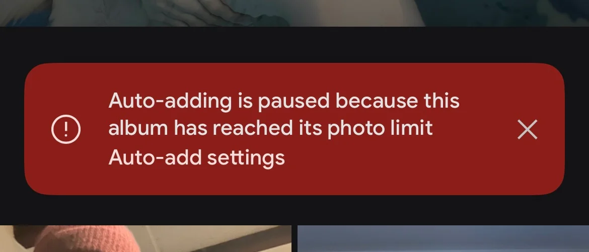

I learned just recently about something that struck me as curious: Google Photos limits albums to 20,000 photos. I was reconfiguring a Google Nest Hub we have at home and wanted to make some adjustments when I was greeted with the message that my album was no longer auto-updating because the album hit the 20,000 photos limit. This struck me as odd. What's special about 20,000?

> Each album can contain up to 20,000 media items.[^1]

To explain this feature quickly: you can select people & pets and have them automatically added to an album. So the little screen in our kitchen should display pictures of our family. So far so good. But it stopped showing recent photos and the reason was that I hit the 20k limit.

Let's dive in and try to understand the rationale for this _seemingly arbitrary_ number.

**Disclaimer**: I am not affiliated with Google in any way and I am theorizing why or how this number was picked. I have no insight into Google Photos. If you're working at big G, maybe even on the Google Photos product, and snickering at this please drop me a note of what is wrong or what I got right.

I think there are a couple of dimensions to this question – at least from the outside perspective – and I'll talk about each of them and come up with a conclusion.

## Nothing Special about 20,000

Programmers have the special sight and ability to immediately identify magic values. _I say 65536, you say short!_ We can immediately see that 20,000 is at no special boundary, it looks arbitrary. Computing \(log_{2}{20000}\) yields approximately 14.2877. We'd need 15 bits to store 20,000 but then our upper bound is \(2^{15}=32768\). This seems very unlikely to me. I highly doubt Google Photos is using 15 bits to store the album counter, and even if that were true, they could easily make it 30,000. 

Personally I also do not know any data structure or algorithm that degenerates at 20,000. In computer terms, it is a rather small value. The mystery continues.

Our first clue: Google Photos started with a limit of just 10,000 photos per album, when they introduced the "Live Albums" feature in 2018. Apparently, just two months later, they bumped the limit from 10,000 to 20,000[^2]. This was seven years ago. I imagine people hit 10k back in 2018 already and seven years is enough time to hoard even more photos. I have been using Google Photos since its inception in 2015. My family album would contain north of 40,000 items at the time of writing.  

In any case, neither 10,000 nor 20,000 sits at a bit boundary. It seems more like an administrative value. I will use \(n\) instead of 20,000 for the rest of the blog post.

## Exhausting Identifiers

For our purposes, we've identified that \(n\) is not at a bit boundary and the next question is what identifiers are used for photos. Let's assume \(m = sizeof(\text{photo identifier})\) and see if \(n \times m\) sits at any special boundary. The photos API tells us that photo identifiers are strings[^3]. They are 44 characters long and look like `AF1QipOuuW[...]Xuwvq`. They are most probably `base64url` encoded which decodes to 33 bytes of data, where we'd have 5 header bytes and then 28 bytes of entropy. The `AF1Qip` prefix applies to me at least for all my media items, whereas there's a different prefix for the actual CDN path. 

Base64url is an educated guess and its alphabet is `[a-zA-Z0-9\_\-]` which would match. Decoding the identifier works and the first byte is a suspicious \0-byte which could be some form of version identifier. I believe they are `base64url` because the documentation states that you can append parameters to URLs with `=`[^4]. It also makes sense that identifiers are URL-safe. I have collected a couple of identifiers and they rule out `base62` or `base64`.

This yields two hypotheses:

1. Media identifiers decode with `base64url` to 33 bytes and carry a 5B header, which leaves us with 28B of entropy.   
2. Constant `AF1Qip` ASCII prefix + rest which also yields 28B of entropy.

I am leaning towards hypothesis 1 here as it sounds more likely to me. 

We have done this exercise because we were interested in \(m = sizeof(\text{photo identifier})\). We have three scenarios now.

1. We store the ASCII string which is 44B: `20,000 x 44B = 880,000B = 880KB`
2. We store the entire 33B: `20,000 x 33B = 660,000B = 660KB`
3. We store just the 28B: `20,000 x 28B = 560,000B = 560KB`

Worst case all identifiers of an album will occupy 880KB of space at n=20,000.

That does not sound like a lot. But 28 bytes means we have 224 bits of entropy. To put that into perspective: UUIDv4 contains 122 bits of entropy. I also thought that the Google Photos identifier may carry a UUIDv4 but the typical pattern match does not suggest that's the case (search for a `0x4x` byte, then two bytes later it must be `0b10xxxxxx`). In 2020, Google stated there are 4 trillion photos stored in the service[^5]. \(2^{224}\) still has some headroom ;)

Where does this leave us? 880KB (worst case\!) of space does not sound like a lot or exceeding a BigTable row or Spanner column. 

## Google's Toys

You've probably heard or read about Colossus, BigTable and Spanner. It's worthwhile to examine these services because it's very likely our photo data is stored in some of them. Maybe the limit comes from one of these services.

We know in fact that Google is using Spanner for Google Photos thanks to a blog post on the Google Cloud blog[^6].

This means we can ignore BigTable for our purposes. We can also ignore Colossus, Google's object store. I do not really think that it is extremely relevant to this question. I do assume that all the photos are stored in Colossus, but the metadata, such as which photo belongs to which album, is stored in Spanner.

Let's just give a moment of appreciation for Spanner. I think it's an absolute marvel of technology. Achieving 99.999% reliability at global scale with the latency numbers they provide is just insane. Especially, if you've ever deployed a similar system on your own. If you have not done so, you should read the 2017 paper<ext-link href="https://research.google/pubs/spanner-truetime-and-the-cap-theorem/"></ext-link> on Spanner and TrueTime.

The blog post linked above clearly states Spanner is being used. Spanner has also publicly documented limits of 10 MiB per column[^13]. Our 880KB value is far below that value if we were to store it like that. What else could be the reason?

## Albums vs. Collections

Aside from albums, Google Photos also contains Collections. This is where the ML-sauce creates "all pictures of person X". Guess what the limit is on these? You guessed right. There's no limit. However, Collections are "views" of the photos. They cannot be mutated.

What sets collections apart from albums is:

* Collections cannot be shared; you must export them as an album first  
* Collections do not support re-ordering of photos  
* Collections are asynchronous; you don't know when a picture will show up in them  
* Collections cannot be sorted; albums support newest, oldest and recently added  
* Albums can be downloaded; this is not possible for collections  
* Converting collections to albums, and auto-add to albums from collections, is asynchronous  
* You cannot delete from collections but from albums

### Sharing

If person `X` shares an album `A` with person `Y`, all edits on `A` must be synced between `X` and `Y`. That is, if \(p\) persons must receive these changes, we have \(p \times \Delta\) changes that might fan out. What's the worst case? \(\Delta_{max}\) is \(n\). If I create an album with n items and share it with you, your client may need to fetch n items in the worst case (the manifest) and then see incremental changes. This might be the first actual reason for choosing n=20,000. I don't want to rule sharing out per se, but I think the cold-sync or worst case don't justify the numbers.

### Re-Ordering 

We do not know what Google Photos is using internally for its ordering. There are two obvious ways ordering can be done. With a linear index, or with a fractional index. The linear index will mean the cost of ordering is always \(O(n)\). That could be a reason, but I doubt the folks at Google would use it. With fractional indices the cost of reordering is \(O(1)\) with a \(O(n)\) step only when you run out of precision, or if you decide to rebalance. Fractional ordering is this idea where you say: I want to move `X` between `Y` and `Z`, so I will set \(X_i=\frac{Y_i+Z_i}{2}\). You would probably have to batch the rebalance as a single mutation and for atomicity. That yields a maximum batch size of n regardless of the re-ordering strategy. But we don't know if Google does this. Spanner does support secondary indices, so I could imagine the order is stored in a secondary index.

### Sorting

Regardless of the direction, sorting means we must re-order the entire album. This is most probably \(O(n)\). I don't believe it's a form of special traversal, as you can sort and _then_ re-order.

### Download All

Once again another bulk operation at \(O(n)\) but this one is probably read-only.

### Deletion

You can select all n items and remove them from an album. Shift-select from top to bottom works. This is another \(O(n)\) candidate.

## The Schema Guess

How does Spanner fit into all of this and how does it relate to n?

In early 2018, Spanner had a cap of …drum-roll… 20,000 mutations per commit[^7]. But Google Photos was at 10,000 back then. Why the discrepancy?

If you have a secondary index, say the order for photos within an album, that would also count against your mutation bucket. Now all of a sudden, deleting 10,000 images becomes 20,000 mutations.

Here's a quick reminder of how a secondary index works:

```sql  
CREATE TABLE Membership (  
  album_id   BYTES,  
  item_id    BYTES,  
  position   BYTES,        -- custom order
  added_time TIMESTAMP,  
  ...  
) PRIMARY KEY (album_id, item_id), 
  INTERLEAVE IN PARENT Albums ON DELETE CASCADE;

CREATE INDEX MembershipByPosition ON Membership(album_id, position);  
```

If I were to delete an entire album and we have \(k\) indices, the mutation budget is at the minimum \(n \times k\). This means when Google Photos introduced live albums, it makes sense that 10,000 was a cap, if there was for example a secondary index at play.

The Spanner release notes state a move from 20,000 to 40,000 mutations per commit was done on September 27th, 2022[^8].

September 30th 2022, Google publicly announced they moved from 40,000 mutations per commit to 80,000 mutations per commit[^9]. The changelog states December 2023 as the actual release date[^10]. The timeline seems a bit off here. However, what matters is that it certainly was at 20,000 when Google Photos introduced Live Albums and they never bumped their numbers regardless of Spanner.

Live Albums were introduced in late 2018 with n=10,000 and then two months later they set n=20,000. At this point, we can only speculate. Working closely with cloud providers certainly has proven to me that limits are only for the masses. The Google Photos team could have had access to an internal version of Spanner, or simply received increased usage limits. Just because the peasants have to live with 80,000 mutations per commit does not mean internal products have to play by the rules.

This is to me the strongest evidence for the 20,000 limitation. Given that Spanner increased their mutation limit I would hope that Google Photos is actually able to increase their album limit as well. Several years have passed since auto-add was introduced in Google Photos and the last time the Spanner limits were increased. 

Note that Spanner also supports partitioned DML<ext-link href="https://cloud.google.com/spanner/docs/dml-partitioned"></ext-link> which means the mutation limit is not necessarily a hard threshold. But the worms want to stay in their cans. Or do they? It could very well be that a PM picked a round abuse-prevention/UX cap with no deep technical cause. Full-album delete doesn't have to be one commit, so the mutation cap doesn't force a 20k album cap.

## Google Drive

What is the limit of items in a folder? Google Drive is at n=500,000[^11]. Folders can also be shared. But you know what you cannot do? Manually sort (all) files in a folder. You can download an entire folder though, but we assume that's probably read-only. Deleting a folder moves it to the trash at \(O(1)\) where it is eventually fully deleted _later_.

It's interesting to see how different teams impose different limits. Google Drive is in fact older than Google Photos, being released in 2012[^12].

## The Client Theory

I thought initially there were many Android devices around, many with fairly limited memory and processing capabilities. I thought it may have been the reason why a PM chose 20,000 as the upper limit of albums. But given that Google Drive can handle 25x that in folders I do not see any substance to this theory.

## Conclusion

My best bet for the 20,000 limit is Spanner mutation budgets plus maybe some internal SLOs that must be hit — or that this number is completely non-technical. It makes sense: secondary indices, which albums most probably use, count against this budget. The 20,000 number seems outdated according to the improvements to Spanner and I hope a PM sees this blog post, bumps the numbers and ultimately receives a big fat bonus. You can do it! Us photo hoarders need larger albums. 🥺👉👈 

[^1]: https://developers.google.com/photos/library/reference/rest/v1/albums/batchAddMediaItems 
[^2]: https://www.androidpolice.com/2018/12/19/google-photos-bumps-album-limit-up-to-20000-pictures/
[^3]: https://developers.google.com/photos/library/reference/rest/v1/mediaItems
[^4]: https://developers.google.com/photos/picker/guides/media-items
[^5]: https://blog.google/products-and-platforms/products/photos/storage-changes/
[^6]: https://cloud.google.com/blog/products/databases/google-photos-builds-user-experience-on-spanner
[^7]: https://github.com/mozilla-services/syncstorage-rs/issues/318
[^8]: https://docs.cloud.google.com/spanner/docs/release-notes#September_27_2022
[^9]: https://cloud.google.com/blog/products/databases/cloud-spanner-doubles-the-number-of-updates-per-transaction
[^10]: https://docs.cloud.google.com/spanner/docs/release-notes#December_18_2023
[^11]: https://support.google.com/a/users/answer/7338880
[^12]: https://en.wikipedia.org/wiki/Google_Drive
[^13]: https://cloud.google.com/spanner/quotas