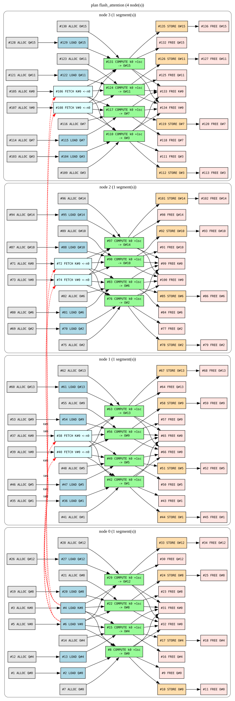
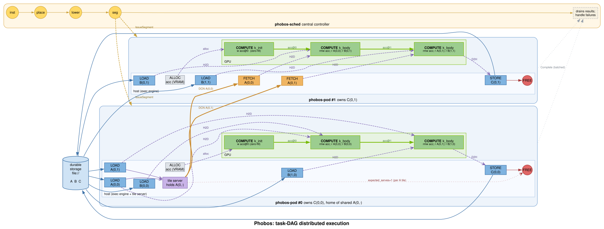
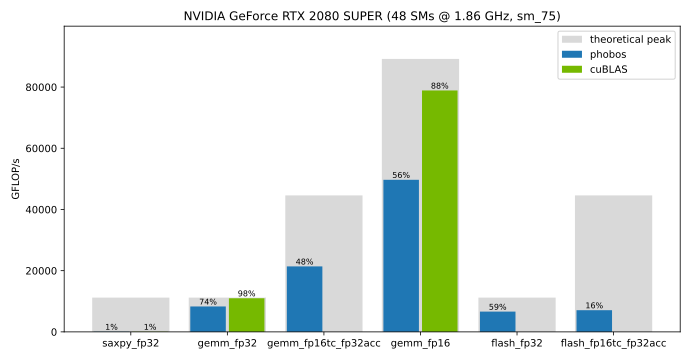

> **TLDR:** I've built [Phobos](https://github.com/joa/phobos), a tiny kernel language inspired by Triton. It lowers to PTX and runs on NVIDIA GPUs. It achieves acceptable performance at 76% of cuBLAS SGEMM GFLOP/s on a 2080 SUPER (or 74% of the theoretical GFLOP/s peak). Phobos maps naturally to a distributed tile-DAG design. I only validated the cluster prototype on a single machine; there are no multi-node benchmarks here. This was a personal research project to gain a better understanding of low-level GPU concepts. I only realized the potential for distributed computing when implementing local tile optimizations.

---

Ever since I was a kid and started to learn about (artificial) neural networks, I was fascinated by the human brain and AI to the point where I built object recognition software in my bedroom, using shitty webcams and a 1.8 GHz CPU for training. When I finished school I enrolled in Cognitive Informatics at Bielefeld University. Though, after a mere four days, I dropped out because I got a job offer from a startup in Paris and wanted to see the world.

In the following years, I worked a lot on optimization, compilers and other machine learning related topics. I still follow the research, but I am an outsider to frontier AI research and tech.

Here I am, back again with a shitty 2080 SUPER. Eager to learn.

I strongly believe, in order to fully understand something, you really need to _do the work_ and get your hands dirty. And because I have experience with compilers, optimization and LLVM, I thought writing a tiny language and compiler to target GPUs is approachable for me.

I also have enough experience with software engineering, and compilers, to know that I must tread carefully. I want to keep this a learning exercise. It could very well snowball into a project that would consume too much of my available time if I take a wrong turn. Compilers are particularly tricky. Without being able to compile a program from start to end, you won't see anything. Compiling a program is not trivial per se, so I am going to take some shortcuts. There won't be any sort of linking or a phase model.

**The goal**: create a small language that compiles and runs on NVIDIA GPUs. In doing so, I want to pick a model well suited for AI computations. It should make optimizations possible without having to reconstruct the semantics of typical AI kernels. I know that I want to support first class tensor types / tiles. In fact, the entire language is oriented around tiles.

Here are two example programs I want to be able to compile. I'll explain in more detail when we get to the language.

### Vector Addition
This is \(\vec{c} = \vec{a} + \vec{b}\).

```text
@autotune(BLOCK in [1024])
kernel add(a: tensor<f32>[N], b: tensor<f32>[N], c: tensor<f32>[N]) {
    let base = program_id(0) * BLOCK
    c[base :+ BLOCK] = a[base :+ BLOCK] + b[base :+ BLOCK]
}
```

### Matrix Multiplication
This is \(\mathbf{C}_{M \times N} = \alpha \mathbf{A}_{M \times K} \mathbf{B}_{K \times N} + \beta \mathbf{C}_{M \times N}\).

```text
@autotune(TILE_M in [32, 128], TILE_N in [64, 256], TILE_K in [16, 64])
kernel sgemm(A: tensor<f32>[M, K],
              B: tensor<f32>[K, N],
              C: tensor<f32>[M, N],
              alpha: f32,
              beta: f32) {
  let pm = program_id(0)
  let pn = program_id(1)
  var acc: tile<f32>[TILE_M, TILE_N] = 0.0
  for kt in range(0, K, TILE_K) {
    var a = A[pm * TILE_M :+ TILE_M, kt :+ TILE_K]
    var b = B[kt :+ TILE_K, pn * TILE_N :+ TILE_N]
    acc += dot(a, b)
  }
  let c_old = C[pm * TILE_M :+ TILE_M, pn * TILE_N :+ TILE_N]
  C[pm * TILE_M :+ TILE_M, pn * TILE_N :+ TILE_N] = alpha * acc + beta * c_old
}
```

> **Side Note:** If you are familiar with kernel development, then yes: it's basically a mini-Triton<ext-link href="https://triton-lang.org/"></ext-link>.

## Unfamiliar Territory

Let's start to get to know CUDA and its target format. If we look at resources such as _CUDA Refresher: Getting started with CUDA_<ext-link href="https://developer.nvidia.com/blog/cuda-refresher-getting-started-with-cuda/"></ext-link>, we are greeted with samples that look like this:

```c
/** CUDA kernel device code - CUDA Sample Codes
 * Computes the vector addition of A and B into C.
 * The three vectors have the same number of elements as numElements. 
 */
__global__ void vectorAdd( float *A, float *B, float *C, int numElements) {
  int i = blockDim.x * blockIdx.x + threadIdx.x;
  if (i < numElements) {
    C[i] = A[i] + B[i];
  }
}
```

We are not interested in that. This is high-level code. We want the x64 of the GPU, not the C++. I first looked at the _NVIDIA CUDA Compiler_ (NVCC) docs[^1]. However this is very convoluted as `nvcc` is what links entire executables. The CUDA docs[^2] themselves have a section that's more in our domain: _PTX and low-level programming_. Low-level programming is what we want. 

> PTX provides a stable programming model and instruction set for general purpose parallel programming. It is designed to be efficient on NVIDIA GPUs supporting the computation features defined by the NVIDIA Tesla architecture. High level language compilers for languages such as CUDA and C/C++ generate PTX instructions, which are optimized for and translated to native target-architecture instructions. [^3]

There's an existing LLVM backend we can use, called NVPTX<ext-link href="https://llvm.org/docs/NVPTXUsage.html#introduction"></ext-link>. We have an idea for our pipeline now.

**Source Code ⟶ Lexer ⟶ Parser ⟶ Codegen ⟶ LLVM IR ⟶ NVPTX ⟶ PTX ⟶ GPU**

PTX is not the machine code the GPU runs but it is as close as we can get. SASS is the actual machine code[^4], but undocumented.

But there's more. _There always is._ The feature creep. I can feel it. MLIR<ext-link href="https://mlir.llvm.org/"></ext-link> is the way to go now[^5]. Let's use it instead of producing LLVM IR. In fact, I do not plan to use MLIR features, like a custom dialect. But it gives me the option to reach for CUTLASS-like performance for free...a man can dream. Seriously though, MLIR exposes many instructions that I'll need.

**Source Code ⟶ Lexer ⟶ Parser ⟶ Codegen ⟶ MLIR ⟶ PTX ⟶ GPU**

For this project I am also going to use Rust because it has bindings for LLVM with `inkwell`, MLIR with the `melior`<ext-link href="https://crates.io/crates/melior"></ext-link> crate and it supports pattern matching, which makes writing compilers _100x_ more pleasant. I had hopes that using MLIR would be as "simple" as using `inkwell`. But alas, it took me many hours of yak-shaving, patching the `melior`, `mlir-sys` and `tblgen-rs` crates, and other horrors, until I was able to compile a simple program.

> When I started this little adventure, I generated some PTX straight from LLVM IR just to get to know everything. That was the obvious path forward for me. But I quickly learned about MLIR. Getting started with inkwell took maybe a couple of hours. Getting melior and MLIR to work took me two days.

### Right-to-Left

Because many things can break here, I am going from right-to-left. I am going to start with the most isolated task: run PTX code on the GPU. It is inevitably something I will have to do later.

Let's write the `vectorAdd` from above in PTX and run it with the `cust`<ext-link href="https://crates.io/crates/cust"></ext-link> crate. 

First we need to understand the compute cap of our GPU. In my case, it's a 7.5 for the Turing family. Yes, I have a pretty old GPU with only 8GB VRAM. Sadly, it also lacks `float32` tensor cores — but I do have 16-bit precision available. We can work with that.

```text
$ nvidia-smi --query-gpu=name,compute_cap
name, compute_cap
NVIDIA GeForce RTX 2080 SUPER, 7.5
```

We can now start to write PTX. This should feel familiar if you've ever written LLVM IR by hand. At least we don't have to write all of this in SSA form. In any case, this was the only PTX code I planned to write manually. Running the assembler directly with `ptxas add.ptx` was a useful sanity check to isolate any issues from Rust or the CUDA crate I am using. We can also compile kernels to PTX via `nvcc -ptx in.cu -o out.ptx` which is very helpful. We can write a kernel, compile it with the official toolchain, and inspect the generated PTX output.

```text
.version 9.0     // 9.3 should work, but does not?
.target sm_75    // target arch (compute cap)
.address_size 64

.visible .entry add(
  .param .u64 a,
  .param .u64 b,
  .param .u64 c,
  .param .u32 numElements
) {
  .reg .pred  %p;
  .reg .f32   %f<4>;
  .reg .b32   %r<5>;
  .reg .b64   %rd<11>;

  ld.param.u64  %rd1, [a];
  ld.param.u64  %rd2, [b];
  ld.param.u64  %rd3, [c];
  ld.param.u32  %r1,  [numElements];

  // i = blockIdx.x * blockDim.x + threadIdx.x
  mov.u32       %r2, %ctaid.x;
  mov.u32       %r3, %ntid.x;
  mov.u32       %r4, %tid.x;
  mad.lo.s32    %r2, %r2, %r3, %r4; // %r2 is i

  // if i >= numElements, return
  setp.ge.s32   %p, %r2, %r1;
  @%p bra       DONE;

  // byte offset = i * 4
  mul.wide.s32  %rd4, %r2, 4;

  // %f1 = a[i * 4]
  cvta.to.global.u64 %rd5, %rd1;
  add.s64       %rd6, %rd5, %rd4;
  ld.global.f32 %f1, [%rd6];

  // %f2 = b[i * 4]
  cvta.to.global.u64 %rd7, %rd2;
  add.s64       %rd8, %rd7, %rd4;
  ld.global.f32 %f2, [%rd8];

  // %f3 = %f1 + %f2
  add.f32       %f3, %f1, %f2;

  // c[i * 4] = %f3
  cvta.to.global.u64 %rd9, %rd3;
  add.s64       %rd10, %rd9, %rd4;
  st.global.f32 [%rd10], %f3;

DONE:
    ret;
}
``` 

```text
$ cargo run
   Compiling phobos v0.1.0 (C:\Users\joaeb\code\phobos)
    Finished `dev` profile [unoptimized + debuginfo] target(s) in 0.63s
     Running `target\debug\phobos.exe`
1048576 elements correct
```
I include the Rust code here as we will come back to it later for testing purposes.

<details>
  <summary>Executing PTX on the GPU with Rust &amp; cust</summary>

```rust
use cust::prelude::*;

const PTX: &str = include_str!("../ptx/add.ptx");

fn main() -> anyhow::Result<()> {
    let _ctx = cust::quick_init()?; // init driver

    let module = Module::from_ptx(PTX, &[])?; // compile the code
    let stream = Stream::new(StreamFlags::NON_BLOCKING, None)?;
    let func = module.get_function("add")?;

    let n: i32 = 1 << 20; // create some data
    let a: Vec<f32> = (0..n).map(|i| i as f32).collect();
    let b: Vec<f32> = (0..n).map(|i| (2 * i) as f32).collect();
    let mut c = vec![0.0f32; n as usize];

    let a_dev = a.as_slice().as_dbuf()?; // write to gpu
    let b_dev = b.as_slice().as_dbuf()?;
    let c_dev = c.as_slice().as_dbuf()?;

    let block: u32 = 256; // run our code
    let grid: u32 = (n as u32 + block - 1) / block;

    unsafe {
        launch!(func<<<grid, block, 0, stream>>>(
            a_dev.as_device_ptr(),
            b_dev.as_device_ptr(),
            c_dev.as_device_ptr(),
            n
        ))?;
    }

    // wait for gpu to complete
    stream.synchronize()?;

    // read from gpu
    c_dev.copy_to(&mut c)?;

    // sanity check
    for i in 0..n as usize {
        assert_eq!(c[i], a[i] + b[i]);
    }

    println!("{n} elements correct");

    Ok(())
}
```
</details>

The source code we provide (PTX) is getting JIT compiled by the driver for the specific GPU to SASS. This makes sense as the same code should run on many different GPUs. If we introduce errors to the PTX, a mere "JIT error" message will be thrown at us. `ptxas` can help us identify what's actually broken. Profiling our binary with `ncu` works as well. Nice.

I have certainly a better understanding of the stack now. I can run low-level code on the GPU and verify it on the CPU. Let's revisit the pipeline from earlier.

**Source Code ⟶ Lexer ⟶ Parser ⟶ Codegen ⟶ MLIR ⟶ <span style="color: #383">PTX ⟶ GPU</span>**

We have started at the finish line. But that's good. At least for me, this was the most uncertain part. Everything else is known territory from now on, mostly.

## The Devil You Knew

I really like LLVM and I used to work a lot with it for a sea-of-nodes IR where I started with Java bytecode, parsed that to an IR of mine, did my transformations and then lowered to LLVM IR which I could then use to emit to x64 or WASM. MLIR did not exist back then. This was now more than 10 years ago. MLIR would have been a good fit to model Java's high-level constructs. For example, property access throws a `NullPointerException`. The high-level IR I created contained nodes like `null-check`, to then emit many LLVM IR nodes out of these. Custom MLIR dialects would allow me to express this within the LLVM IR universe.[^6] I thought initially that I was going with the same pattern `… ⟶ Parser ⟶ IR ⟶ Optimizer ⟶ Codegen ⟶ LLVM IR ⟶ …` but dropped the entire IR and Optimizer idea in favor of MLIR.

Getting `melior` to work on Windows took some time. Lucky for you, I created PRs for `melior`<ext-link href="https://github.com/mlir-rs/melior/pull/858"></ext-link>, `mlir-sys`<ext-link href="https://github.com/mlir-rs/mlir-sys/pull/93"></ext-link> and `tblgen-rs`<ext-link href="https://github.com/mlir-rs/tblgen-rs/pull/73"></ext-link>. One of the worst things I ever had to deal with: a file named `*.instructions.md` was committed to one of the repos and guess what. NTFS really does not like `*` in file names. I'll spare you the details of this entire saga, but fun fact: I compiled an x86 LLVM initially when Rust was targeting x64. If you know how long it takes to compile LLVM, you know what that means in terms of a time waste.

With this out of the way, I can start to generate my first kernel via code.

## Creating PTX with MLIR

We have a very simple `c[i] = a[i] + b[i]` kernel in PTX and we have Rust working with MLIR. The logical next step is to re-create the PTX with MLIR and run it.

It's not that simple though. `melior` can't lower to PTX directly. I _could_ use an external tool, `mlir-opt`, which lowers the MLIR to PTX for me but I want simple things. It's LLVM all the way down. Funny enough, when I started this project, I used `inkwell`<ext-link href="https://crates.io/crates/inkwell"></ext-link> to create a kernel programmatically, and compile it to PTX. With the MLIR module, I now lower it to LLVM IR and use the NVPTX backend. Only downside? Well...when I compiled LLVM the last time it was without the NVPTX target arch. Third time's the charm!

**Source Code ⟶ Lexer ⟶ Parser ⟶ Codegen ⟶ MLIR ⟶ LLVM IR ⟶ NVPTX Backend ⟶ <span style="color: #383">PTX ⟶ GPU</span>**

The code starts to get a lot more verbose so here are the basic ideas:

```rust
// generic function to produce ptx code as a string.
// it takes a closure to fill in the actual function body.
pub fn gen_ptx<'p, F>(ctx: &'p phobos_base::context::Context, body: F) -> anyhow::Result<String>
where
    F: for<'c> FnOnce(
        &'p phobos_base::context::Context,
        &'c Context,
        &Module<'c>,
    ) -> anyhow::Result<()>,
{
    // MLIR setup
    let registry = DialectRegistry::new();
    register_all_dialects(&registry);

    let context = Context::new();
    //...
    let loc = Location::unknown(&context);
    let module = Module::new(loc);

    // fill in the function body
    body(&ctx, &context, &module)?;

    // generate PTX (string) from MLIR
    lower_mlir_to_ptx(&ctx, &context, module)
}

// recreating the ptx code for c[i] = a[i] + b[i] with MLIR
fn build_add_ir<'a>(
    _: &'a phobos_base::context::Context,
    ctx: &'a Context,
    module: &Module<'a>,
) -> anyhow::Result<()> {
    let loc = Location::unknown(ctx);
    let i32t: Type = IntegerType::new(ctx, 32).into();
    let f32t = Type::float32(ctx);
    let idx_t = Type::index(ctx);
    let mem_space: Attribute = IntegerAttribute::new(IntegerType::new(ctx, 64).into(), 1).into();
    let memref_t: Type = MemRefType::new(f32t, &[i64::MIN], None, Some(mem_space)).into();

    // ... this is where we add all the instructions ...

    let gpu_module = OperationBuilder::new("gpu.module", loc)
        .add_attributes(&[(
            Identifier::new(ctx, "sym_name"),
            StringAttribute::new(ctx, "kernels").into(),
        )])
        .add_regions([gpu_mod_region])
        .build()?;

    module.body().append_operation(gpu_module);

    Ok(())
}

run_on_gpu(gen_ptx(ctx, build_add_ir));
```

<details>
  <summary>
    <strong>Phase 1:</strong> The generated MLIR
  </summary>

This could be achieved in many different ways. I wanted to use the `gpu`, and `memref` dialects early on.
`memref<?xf32, 1>` states: we have a type with an unknown `f32` dimension in address space `1`.

We could actually say `memref<1024xf32, 1>` but, we don't know the size of our vectors (yet).

```plain
module {
  gpu.module @kernels {
    gpu.func @add(%arg0: memref<?xf32, 1>, %arg1: memref<?xf32, 1>, %arg2: memref<?xf32, 1>, %arg3: i32) kernel {
      // i = blockIdx.x * blockDim.x + threadIdx.x
      %thread_id_x = gpu.thread_id  x
      %block_id_x = gpu.block_id  x
      %block_dim_x = gpu.block_dim  x
      %0 = arith.index_cast %thread_id_x : index to i32
      %1 = arith.index_cast %block_id_x : index to i32
      %2 = arith.index_cast %block_dim_x : index to i32
      %3 = arith.muli %1, %2 : i32
      %4 = arith.addi %3, %0 : i32

      // i_index = i as usize
      %5 = arith.index_cast %4 : i32 to index

      // i < n
      %6 = arith.cmpi slt, %4, %arg3 : i32
      cf.cond_br %6, ^bb1, ^bb2

    ^bb1:  // pred: ^bb0
      // load a[i_index] and b[i_index]
      %7 = memref.load %arg0[%5] : memref<?xf32, 1>
      %8 = memref.load %arg1[%5] : memref<?xf32, 1>
      
      // a + b
      %9 = arith.addf %7, %8 : f32

      // assign to c[i_index]
      memref.store %9, %arg2[%5] : memref<?xf32, 1>
      cf.br ^bb2
    ^bb2:  // 2 preds: ^bb0, ^bb1
      gpu.return
    }
  }
}
```
</details>

<details>
  <summary>
    <strong>Phase 2:</strong> MLIR Lowering
  </summary>

You can see that each `memref` argument expands to a total of five. The reason is that `memref` is overkill for this little example but still a good learning exercise.

Instead of a single float pointer `ptr`, we now have `(ptr, align_ptr, offset, size, stride)`. 

For example, `memref.load %arg0[%5] : memref<?xf32, 1>` expands to pseudo code of `load element_ptr` with `element_ptr = align_ptr + (offset + stride * INDEX) * sizeof(element)`. In our case, we have `sizeof(element) = 4` because the type is `f32`. We have `offset=0, stride=1` which means `element_ptr = align_ptr + (offset + stride * INDEX) * sizeof(element) = align_ptr + (0 + 1 * INDEX) * 4` ergo `element_ptr = align_ptr[INDEX * 4]`.

The layout of our `memref` type actually specifies `offset=0, stride=1`. Since these are compile time constants, the additional arguments are unused but part of our ABI.

```plain
module {
  gpu.module @kernels [#nvvm.target<O = 3, chip = "sm_75", features = "+ptx90">] {
    llvm.func @add(%arg0: !llvm.ptr<1>, %arg1: !llvm.ptr<1>, %arg2: i64, %arg3: i64, %arg4: i64, %arg5: !llvm.ptr<1>, %arg6: !llvm.ptr<1>, %arg7: i64, %arg8: i64, %arg9: i64, %arg10: !llvm.ptr<1>, %arg11: !llvm.ptr<1>, %arg12: i64, %arg13: i64, %arg14: i64, %arg15: i32) attributes {gpu.kernel, nvvm.kernel} {
      %0 = nvvm.read.ptx.sreg.tid.x : i32
      %1 = llvm.sext %0 : i32 to i64
      %2 = nvvm.read.ptx.sreg.ctaid.x : i32
      %3 = llvm.sext %2 : i32 to i64
      %4 = nvvm.read.ptx.sreg.ntid.x : i32
      %5 = llvm.sext %4 : i32 to i64
      %6 = llvm.trunc %1 : i64 to i32
      %7 = llvm.trunc %3 : i64 to i32
      %8 = llvm.trunc %5 : i64 to i32
      %9 = llvm.mul %7, %8 : i32
      %10 = llvm.add %9, %6 : i32
      %11 = llvm.sext %10 : i32 to i64
      %12 = llvm.icmp "slt" %10, %arg15 : i32
      llvm.cond_br %12, ^bb1, ^bb2
    ^bb1:  // pred: ^bb0
      %13 = llvm.getelementptr inbounds|nuw %arg1[%11] : (!llvm.ptr<1>, i64) -> !llvm.ptr<1>, f32
      %14 = llvm.load %13 : !llvm.ptr<1> -> f32
      %15 = llvm.getelementptr inbounds|nuw %arg6[%11] : (!llvm.ptr<1>, i64) -> !llvm.ptr<1>, f32
      %16 = llvm.load %15 : !llvm.ptr<1> -> f32
      %17 = llvm.fadd %14, %16 : f32
      %18 = llvm.getelementptr inbounds|nuw %arg11[%11] : (!llvm.ptr<1>, i64) -> !llvm.ptr<1>, f32
      llvm.store %17, %18 : f32, !llvm.ptr<1>
      llvm.br ^bb2
    ^bb2:  // 2 preds: ^bb0, ^bb1
      llvm.return
    }
  }
}
```
</details>

<details>
  <summary>
    <strong>Phase 3:</strong> MLIR to LLVM IR
  </summary>

This is what `mlir_sys::mlirTranslateModuleToLLVMIRToString` gives us. We are back in LLVM territory at this point.

```plain
; ModuleID = 'LLVMDialectModule'
source_filename = "LLVMDialectModule"

define ptx_kernel void @add(ptr addrspace(1) %0, ptr addrspace(1) %1, i64 %2, i64 %3, i64 %4, ptr addrspace(1) %5, ptr addrspace(1) %6, i64 %7, i64 %8, i64 %9, ptr addrspace(1) %10, ptr addrspace(1) %11, i64 %12, i64 %13, i64 %14, i32 %15) {
  %17 = call i32 @llvm.nvvm.read.ptx.sreg.tid.x()
  %18 = sext i32 %17 to i64
  %19 = call i32 @llvm.nvvm.read.ptx.sreg.ctaid.x()
  %20 = sext i32 %19 to i64
  %21 = call i32 @llvm.nvvm.read.ptx.sreg.ntid.x()
  %22 = sext i32 %21 to i64
  %23 = trunc i64 %18 to i32
  %24 = trunc i64 %20 to i32
  %25 = trunc i64 %22 to i32
  %26 = mul i32 %24, %25
  %27 = add i32 %26, %23
  %28 = sext i32 %27 to i64
  %29 = icmp slt i32 %27, %15
  br i1 %29, label %30, label %37

30:                                               ; preds = %16
  %31 = getelementptr inbounds nuw float, ptr addrspace(1) %1, i64 %28
  %32 = load float, ptr addrspace(1) %31, align 4
  %33 = getelementptr inbounds nuw float, ptr addrspace(1) %6, i64 %28
  %34 = load float, ptr addrspace(1) %33, align 4
  %35 = fadd float %32, %34
  %36 = getelementptr inbounds nuw float, ptr addrspace(1) %11, i64 %28
  store float %35, ptr addrspace(1) %36, align 4
  br label %37

37:                                               ; preds = %30, %16
  ret void
}

; Function Attrs: nocallback nofree nosync nounwind speculatable willreturn memory(none)
declare noundef range(i32 0, 1024) i32 @llvm.nvvm.read.ptx.sreg.tid.x() #0

; Function Attrs: nocallback nofree nosync nounwind speculatable willreturn memory(none)
declare noundef range(i32 0, 2147483647) i32 @llvm.nvvm.read.ptx.sreg.ctaid.x() #0

; Function Attrs: nocallback nofree nosync nounwind speculatable willreturn memory(none)
declare noundef range(i32 1, 1025) i32 @llvm.nvvm.read.ptx.sreg.ntid.x() #0

attributes #0 = { nocallback nofree nosync nounwind speculatable willreturn memory(none) }

!llvm.module.flags = !{!0}

!0 = !{i32 2, !"Debug Info Version", i32 3}
```
</details>

<details>
  <summary>
    <strong>Phase 4:</strong> The generated PTX
  </summary>

This looks very close to the PTX code we generated manually. Success! It is the LLVM IR lowered with the NVPTX backend.

```plain
//
// Generated by LLVM NVPTX Back-End
//

.version 9.0
.target sm_75
.address_size 64

        // .globl       add

.visible .entry add(
        .param .u64 .ptr .global .align 1 add_param_0,
        .param .u64 .ptr .global .align 1 add_param_1,
        .param .u64 add_param_2,
        .param .u64 add_param_3,
        .param .u64 add_param_4,
        .param .u64 .ptr .global .align 1 add_param_5,
        .param .u64 .ptr .global .align 1 add_param_6,
        .param .u64 add_param_7,
        .param .u64 add_param_8,
        .param .u64 add_param_9,
        .param .u64 .ptr .global .align 1 add_param_10,
        .param .u64 .ptr .global .align 1 add_param_11,
        .param .u64 add_param_12,
        .param .u64 add_param_13,
        .param .u64 add_param_14,
        .param .u32 add_param_15
)
{
        .reg .pred      %p<2>;
        .reg .b32       %r<9>;
        .reg .b64       %rd<8>;

        mov.u32         %r1, %tid.x;
        mov.u32         %r2, %ctaid.x;
        mov.u32         %r3, %ntid.x;
        mad.lo.s32      %r4, %r2, %r3, %r1;
        ld.param.b32    %r5, [add_param_15];
        setp.ge.s32     %p1, %r4, %r5;
        @%p1 bra        $L__BB0_2;
        ld.param.b64    %rd4, [add_param_1];
        ld.param.b64    %rd5, [add_param_6];
        mul.wide.s32    %rd6, %r4, 4;
        add.s64         %rd1, %rd4, %rd6;
        add.s64         %rd2, %rd5, %rd6;
        ld.param.b64    %rd7, [add_param_11];
        add.s64         %rd3, %rd7, %rd6;
        ld.global.b32   %r6, [%rd1];
        ld.global.b32   %r7, [%rd2];
        add.rn.f32      %r8, %r6, %r7;
        st.global.b32   [%rd3], %r8;
$L__BB0_2:
        ret;

}
```
</details>

Running the PTX is as simple as copy-and-paste of the `cust` example from above now with the added parameters.

**Source Code ⟶ Lexer ⟶ Parser ⟶ Codegen ⟶ <span style="color: #383">MLIR ⟶ LLVM IR ⟶ NVPTX Backend ⟶ PTX ⟶ GPU</span>**

I really like going from right-to-left here instead of the other way around. We get to see and validate things early. Getting everything working with MLIR and LLVM using Rust on Windows was _challenging_.

But now, we really have to start with the source code.

## Introducing the Phobos Language

What got me started on this project was the blog post "How to Optimize a CUDA Matmul Kernel"<ext-link href="https://siboehm.com/articles/22/CUDA-MMM"></ext-link> by Simon Boehm. I found it fascinating to see how a simple matrix multiplication can jump by 70x.

_GEMM_ stands for General Matrix Multiplication \(C = \alpha A B + \beta C\). _SGEMM_ stands for Single-Precision General Matrix Multiplication. All of the types are 32-bit floats.

Simon gives this example for a naive SGEMM implementation:

```c
__global__ void sgemm_naive(int M, int N, int K, float alpha, const float *A,
                            const float *B, float beta, float *C) {
  // compute position in C that this thread is responsible for
  const uint x = blockIdx.x * blockDim.x + threadIdx.x;
  const uint y = blockIdx.y * blockDim.y + threadIdx.y;

  // `if` condition is necessary for when M or N aren't multiples of 32.
  if (x < M && y < N) {
    float tmp = 0.0;
    for (int i = 0; i < K; ++i) {
      tmp += A[x * K + i] * B[i * N + y];
    }
    // C = α*(A@B)+β*C
    C[x * N + y] = alpha * tmp + beta * C[x * N + y];
  }
}
```

No worries. I am not going to recreate the entire blog post here. It's excellent. Go read it. What matters is this:

I want to enable (some of) the optimizations he is going through in my compiler. At least to some degree. I could of course write a little CUDA clone with a different syntax and call it a day. We have the pipeline set up and it would work. But this form of code is hostile to the optimizations we want to perform.

I always thought about deep learning basically as map-reduce, but with matrices. I thought it would make sense to treat computations at the tile level. Tensor Cores are \(M \times N \times K\) processing units anyways. If you think of an \(M \times N \times K\) GEMM, then many of the optimizations are about computing tiny \(M' \times K'\) and \(K' \times N'\) matrices where \(M'\), \(N'\) and \(K'\) are numbers with \(M' \le M \land N' \le N \land K' \le K\). Choosing the right values depends on the actual hardware specification. Hence, the same optimizations that apply locally (keeping tensor cores as busy as possible) scale to the datacenter as well (keeping nodes as saturated as possible).

This is not my idea. There exists the Triton language<ext-link href="https://triton-lang.org/"></ext-link> which does the same on the local level. And there's of course also NVIDIA CUTLASS<ext-link href="https://github.com/NVIDIA/cutlass"></ext-link>, a set of templates for writing extremely fast kernels with the addition of a Python DSL (CuTe).

<details>
  <summary><strong>Side-quest:</strong> Comparing Triton and Phobos</summary>

Triton walks the AST of Python code, uses custom MLIR dialects and is able to emit highly optimized code.

Vector add in Triton[^7] is shown as

```python
@triton.jit
def add_kernel(x_ptr,  # *Pointer* to first input vector.
               y_ptr,  # *Pointer* to second input vector.
               output_ptr,  # *Pointer* to output vector.
               n_elements,  # Size of the vector.
               BLOCK_SIZE: tl.constexpr,  # Number of elements each program should process.
               # NOTE: `constexpr` so it can be used as a shape value.
               ):
    # There are multiple 'programs' processing different data. We identify which program
    # we are here:
    pid = tl.program_id(axis=0)  # We use a 1D launch grid so axis is 0.
    # This program will process inputs that are offset from the initial data.
    # For instance, if you had a vector of length 256 and block_size of 64, the programs
    # would each access the elements [0:64, 64:128, 128:192, 192:256].
    # Note that offsets is a list of pointers:
    block_start = pid * BLOCK_SIZE
    offsets = block_start + tl.arange(0, BLOCK_SIZE)
    # Create a mask to guard memory operations against out-of-bounds accesses.
    mask = offsets < n_elements
    # Load x and y from DRAM, masking out any extra elements in case the input is not a
    # multiple of the block size.
    x = tl.load(x_ptr + offsets, mask=mask)
    y = tl.load(y_ptr + offsets, mask=mask)
    output = x + y
    # Write x + y back to DRAM.
    tl.store(output_ptr + offsets, output, mask=mask)
```

The Phobos version for vector addition looks mostly the same if you ignore the comments:

```plain
@autotune(BLOCK in [1024])
kernel add(a: tensor<f32>[N], b: tensor<f32>[N], c: tensor<f32>[N]) {
    let base = program_id(0) * BLOCK
    c[base :+ BLOCK] = a[base :+ BLOCK] + b[base :+ BLOCK]
}
```

Phobos is really not Triton in the sense that it is much simpler, less feature rich and will break in ways you would not expect. For example, tensors must be a multiple of four, the block size must be divisible by 32 etc. It's a learning exercise, not a production-grade language and there's no point in replicating an existing language 1:1.

What Triton does not do by itself is clustering.
</details>

### GPU Performance

We all know GPUs are fast, thanks to their parallel nature. But it's like with an F1 car: you need a skilled driver to win the race. You have to be able to use the full potential of the hardware. If you spend thousands of GPUs on training, you want to use the resources as efficiently as possible.

Let's start with a GPU primer and understand the concepts of memory levels and execution in a cooperative thread array (CTA) on Streaming Multiprocessors (SM).

The CTA is a group of threads[^8] in which threads can synchronize. The GPU schedules a CTA to an SM, and will not move to a different SM[^9]. SMs have on-chip shared memory.

Within a CTA a subset of threads, called a warp, will execute the same instruction classically in lockstep (SIMT).[^10]

Now, we must understand the different memory regions:

- **Global memory:** This is where we upload the weights. Reading global memory is slow at roughly 300-600 cycles. Physically it's DRAM. GDDR on consumer cards like mine, or HBM (High-Bandwidth Memory) on datacenter parts.
- **Shared memory**: This is memory on an SM per CTA and can be shared between threads. Much faster than global memory but still requires ~20-30 cycles. Physically, this is backed by SRAM (Static Random-Access Memory).
- **Registers**: Registers are physically allocated to individual threads and are the absolute fastest memory (~1 cycle).[^11] They hold the exact data fragments that feed directly into the execution units, such as ALUs or Tensor Cores.

If you want to compute \(C = \alpha \times (A \times B) + \beta \times C\), you have to multiply every row of \(A\) with every column of \(B\). The issue is that both of these live in global memory, but that's slow. In fact, a naive kernel will be memory-bound because the execution units can compute math operations much faster than they can fetch the required data from global memory.

What we want is to keep the GPU as busy as possible, which is achieved by making sure we can feed the ALUs and Tensor Cores constantly. But that's not so simple.

Here are the four primary techniques I am using in Phobos:

1. **Coalescing**: If the 32 threads in a warp read memory in a random order, that results in up to 32 separate memory fetches. The GPU understands when the access is contiguous and can coalesce this into the minimum number of required transactions.
2. **Tiling:** We can reduce fetches from global memory by prefetching the data into a shared memory tile per CTA.
3. **Warp Tiling:** The shared memory tile is partitioned *again* among warps in micro-tiles to maximize register reuse. The memory access patterns within each warp must be structured so that we avoid bank conflicts[^12], where multiple threads in a warp attempt to access the same memory bank simultaneously.
4. **Tensor Cores**: Special hardware to compute \(M \times N \times K\); several times faster than normal SIMT instructions.

In order to implement these techniques, a compiler would have to understand the `blockIdx.x * blockDim.x + threadIdx.x` arithmetic and derive what each thread computes. Furthermore, one needs to prove the affine access to the data pointers (`x * i + y`), whether the pointers alias (`A == B`) and ultimately understand which loads are reused across threads. That's extremely difficult.[^13]

If this is however modeled by your language implicitly, you don't have to reverse engineer anything. 

```plain
@autotune(TILE_M in [32, 128], TILE_N in [64, 256], TILE_K in [16, 64])
@launch(256)
@pipeline
@tensorcore
kernel sgemm(A: tensor<f32>[M, K],
              B: tensor<f32>[K, N],
              C: tensor<f32>[M, N],
              alpha: f32,
              beta: f32) {
  let pm = program_id(0)
  let pn = program_id(1)
  var acc: tile<f32>[TILE_M, TILE_N] = 0.0
  for kt in range(0, K, TILE_K) {
    var a = A[pm * TILE_M :+ TILE_M, kt :+ TILE_K]
    var b = B[kt :+ TILE_K, pn * TILE_N :+ TILE_N]
    acc += dot(a, b)
  }
  let c_old = C[pm * TILE_M :+ TILE_M, pn * TILE_N :+ TILE_N]
  C[pm * TILE_M :+ TILE_M, pn * TILE_N :+ TILE_N] = alpha * acc + beta * c_old
}
```

1. With `@autotune`, we can say that we want `TILE_M` to be a constant in the range `[32, 128]`.
2. The first-class `tensor<f32>[M, K]` specifies we have a two-dimensional tensor with dimensions `M` and `K` of unknown size; I query these at runtime.
3. The thread-id arithmetic is abstracted away by a `program_id` intrinsic that just states how we move in the `x` and `y` directions.
4. `tile<f32>[TILE_M, TILE_N]` declares a CTA-wide tile. The codegen places it in shared memory, in registers, or split across both.
5. `for kt in range(0, K, TILE_K)` advances `kt` from `0` to `K` by `TILE_K`.
6. `A[pm * TILE_M :+ TILE_M, kt :+ TILE_K]` selects the sub-tile of `A` with `x: pm * TILE_M, y: kt, width: TILE_M, height: TILE_K`.
7. `acc += dot(a, b)` is the dot product of two tiles, accumulated into a tile.
8. `C[pm * TILE_M :+ TILE_M, pn * TILE_N :+ TILE_N] = acc` assigns a complete tile.

We do not compute individual values using threads. In fact, the whole concept of threads is abstracted away. Instead we specify arithmetic over 2D-tiles and the code generator will assign the computations to the threads. How tiles are read or written — to the metal — is up to the codegen.

Furthermore, `TILE_M`, `TILE_N` and `TILE_K` become extremely interesting optimization variables. For example, if we set `TILE_M=16`, `TILE_N=16`, and `TILE_K=16`, the codegen can map this `tile<f32>[16, 16]` structure directly to native Tensor Core MMA instructions on my 2080 SUPER[^22].

### Language

I am allergic to semicolons so we are using Go-style semicolon insertion. `A[startOffset : endOffset]` is a range where `endOffset` is exclusive, `A[startOffset :+ numItems]` is the same as `A[startOffset : startOffset + numItems]`. Otherwise, there's nothing really special here. It's a small language. We have `@attributes` and that's about it.

The compiler does not have a phase model, compilation units or linking. It is a simple Lexer, feeding a parser, feeding the code generator.

The code generator is the most complex piece as it performs analysis on the AST to choose the proper output. In a more advanced compiler one could use MLIR dialects and custom passes, or introduce another intermediate representation. Again, I want to keep things simple.

**<span style="color: #383">Source code ⟶ Lexer ⟶ Parser ⟶ Codegen ⟶ MLIR ⟶ LLVM IR ⟶ NVPTX Backend ⟶ PTX ⟶ GPU</span>**

### Runtime

This is not the whole picture. In fact you've seen the `@autotune` annotation. Kernels should be tuned for their specific use case. We have several parameters we can modify. For example, the tiling size that defines the shared memory region is something we can configure, or the padding for warp tiling.

The idea is to specify these parameters and compile a different version of the kernel for the parameter set. If you specify `@autotune(M in [16, 64])` I will generate versions of the kernel for `M = 16`, `M = 32` and `M = 64`. This is intertwined with the code generator and a configuration that can be passed in. In order to find the best configuration we build the Cartesian product of all config values, compile and benchmark all of them, and then pick our winner.

I do this in a brute-force fashion. I try all configurations once, select the best three and then do a longer eval on them. Many configurations do not compile on my GPU anyways. A `TILE_M=256`, `TILE_N=256` accumulator is 256 KB of live data, and it has to be materialized somewhere. Both options are bounded: staged in registers, it blows past the 255-registers-per-thread limit; staged in shared memory, it exceeds even a Blackwell datacenter GPU's 228 KB per SM[^20].

With all of that out of the way, I can say that I am pretty happy with the performance.

> The more I worked on this project and the more optimizations I added, the larger the search space grew. I am not exploring it beyond the current `@autotune` parameters. For example, register pressure is another major axis as I learned: larger tiles or more aggressive unrolling can use more registers per thread, which may allow better local reuse, but it can also reduce the number of CTAs/warps resident on an SM. That occupancy tradeoff can have a profound impact on performance.

## Clustering


Remember how I said I always thought of deep learning as map-reduce? What we currently achieve with first-class tiles is basically:

**Input at M x N ⟶ HBM at M x N ⟶ SRAM at M/m0 x N/n0 ⟶ Warp ⟶ Tensor Core ⟶ Warp ⟶ SRAM ⟶ HBM ⟶ Output at M x N**

The Tensor Core is our atom, the smallest possible unit.

We can add another step and say the data is \(M \times N\) only for the purposes of the GPU, but it actually is much larger. The GPU receives just another sub tile of a much larger datacenter scale supertile.

Previously, it was about keeping the tensor cores busy. And we dance around the latency of the SRAM and the HBM to achieve peak performance.

Now it is about keeping HBM busy, and we have to dance around the latency of the disk and/or the network instead.

The same source is compiled twice. The entire language is scale-free. The additional `@cluster(TILE_M in [...], ...)` attribute just declares one more tiling level above `@autotune`'s device tiles. It reuses the same symbol names. The source code compiles down via two different paths:

- **AST ⟶ device codegen ⟶ MLIR ⟶ PTX**: the per-node kernel
- **AST ⟶ cluster codegen ⟶ cluster IR**: a small dataflow program over supertiles

```plain
@cluster(TILE_M in [4096, 16384], TILE_N in [4096, 16384], TILE_K in [4096, 16384])
@autotune(TILE_M in [32, 256], TILE_N in [32, 256], TILE_K in [4, 32])
kernel sgemm(A: tensor<f32>[M, K], B: tensor<f32>[K, N], C: tensor<f32>[M, N], alpha: f32, beta: f32) {
  // ...
}
```

A supertile is a large piece of a tensor, say 8192x8192 `f32` (256 MiB), and it's the only thing that ever crosses the network (if it has to). The kernel stays the same, just interpreted at different scale: `program_id` now indexes the supertile grid, and a slice `x[y:z]` now refers to a (potentially remote) supertile.

And I really mean the kernel stays the same. Because `@cluster` binds the same `TILE_M`, `TILE_N`, `TILE_K` symbols as `@autotune`, the per-node kernel the cluster compiler distributes is (almost) the original body. The only thing it touches is the epilogue, or the final store, because each node now contributes one `K`-chunk of a much larger
supertile instead of the whole result.[^28]

For a pure reduction (`C[..] = acc`) that's literally one line: the `=` becomes `+=`, and a tiny synthesized init leaf zeroes the supertile first.

The full GEMM epilogue `alpha*acc + beta*c_old` works in a similar way. The `beta*c_old` term can't live inside a `+=` body. It would be re-applied on every `K`-chunk. Therefore the compiler hoists it out of the loop. The init leaf seeds the supertile with `beta*C_orig` once, and the per-chunk store keeps the `alpha*acc + c_old` computation with an implicit beta of 1.

Summed over the chunks it results in \(\beta C_{\text{orig}}\ + \alpha \sum{A_k \times B_k} = \alpha \text{acc} + \beta C_{\text{orig}}\). Same math, and no accumulator ever crosses the network. That's the split shown by the conceptual IR below.

The body that does the actual math is interpreted twice: once at device scale (CTAs on my GPU), once at cluster scale (supertiles across nodes). All from the same AST.

In order to achieve high throughput, one can compute the FLOP/byte and scale the supertiles accordingly for higher arithmetic intensity. This can also be tuned, the same way auto-tune works. 

### The DAG Compiler

The cluster codegen emits a parametric cluster-IR, because the problem shape `M, K, N` only arrives at submission time and doesn't know the node topology. 

The scheduler then instantiates it into a concrete DAG of four primitive instructions: `ALLOC`, `FETCH`, `COMPUTE`, `FREE` (plus `LOAD`/`STORE` at the storage boundary).

What we then have to do is:

1. Classify each tile slice as supertile-aligned (the cluster skeleton) or intra-tile (the leaf body; or the actual kernel). The alignment alone is used to split this information.
2. Loop-carried accumulators are promoted to read-modify-write (RMW) supertile parameters, and SSA over supertile versions \(t_k \to t_{k+1}\) makes each instruction's read/write set exact. And that set is the DAG; nothing else carries dependency information. This is good old compiler def-use chain analysis.
3. Because the DAG makes every supertile's last consumer explicit, lifetimes can be inferred by a backward pass that places the `FREE`s. There is no ownership or lifetime syntax in the language. It all falls out of the graph for free.

> This reads as: for each output supertile, loop over K and accumulate; then write

```plain
// this is a conceptual idea of the cluster IR.
// it's never materialized like this as it's directly consumed
// by the scheduler to emit LOAD, FETCH, ..., ASSIGN
// instructions to the actual nodes in the cluster
cluster sgemm {
  params: M, K, N                        // bound at submission time
  super:  SUPER_M, SUPER_N, SUPER_K      // bound by cluster autotuner
  tensors:
    A: f32[M, K]      in
    B: f32[K, N]      in
    C: f32[M, N]      out
  scalars:
    alpha: f32
    beta:  f32
  grid (pm, pn) in (M/SUPER_M, N/SUPER_N):
    t_c_old = ref C(pm, pn)

    // seed the accumulator with beta * C
    t_acc@0 = compute k_init(beta, t_c_old)
    
    loop kt in 0 .. K/SUPER_K:
      t_a  = ref A(pm, kt)
      t_b  = ref B(kt, pn)
      // accumulate alpha * A_k * B_k into the running C tile.
      t_acc@kt+1 = compute k_body(rmw t_acc@kt, t_a, t_b, alpha)
    
    define C(pm, pn) = t_acc@last
}
```
We can generate the scheduler's plan for a hypothetical 4-node cluster computing Flash Attention[^16].



Every node `LOAD`s its own Q straight from storage[^24] and writes its output back; the K and V tiles have been assigned to the first node and others `FETCH` them via DCN. These are four independent local programs. Each node owns four query blocks, so it loads K and V _once_ and the `COMPUTE`s from the same buffers. Their `FREE` is deferred until the second block is done with them. That lifetime manifests via the backward pass over the graph. We insert a `FREE` at the tile's last use[^25]. And because the second block's `LOAD`s do not depend on the first block's `COMPUTE`, the node prefetches them. That's basically the same overlap I reached for with `@pipeline` at the device level, just one level up.

Submission is done via a simple job description containing inputs, outputs and kernel parameters:

```plain
source = examples/flash_attention.ph
dim Nq = 16384
dim Nk = 16384
dim D = 64
tensor Q = read  f32 16384x64 file:///tmp/q.tensor
tensor K = read  f32 16384x64 file:///tmp/k.tensor
tensor V = read  f32 16384x64 file:///tmp/v.tensor
tensor O = write f32 16384x64 file:///tmp/o.tensor
scalar scale = f32 0.125
```

### Where Does This Fit In?

Some properties have emerged from the design choices:

1. There is no `SYNCHRONIZE` or barrier instruction. Dependencies are the synchronization mechanism. We have therefore an out-of-order task engine.
2. The scheduler is not in the critical path. A node's dependencies are always on the same node; every cross-node edge is in tile space. A consumer's `FETCH` blocks server-side (on a node) until the tile is available. That wait is the synchronization, without a scheduler round-trip. A producer's `FREE` waits on a statically known serve-count. The scheduler only drains batched completion events; its load should be \(O(\text{segments} + \text{failures})\), not \(O(\text{instructions})\) by construction.
3. Tile identifiers are deterministic and if a node dies, re-running the lost subgraph reproduces the same tiles (lineage model).[^14]
4. When possible, accumulators stay on the same node and never travel across the network.

This sits somewhere between the Single Program, Multiple Data (SPMD) and Asynchronous Many-Task (AMT) world. It lands mostly in the task-based distributed linear-algebra lineage, like PaRSEC, Legion, and most directly NVIDIA's Legate. There is a tile-DAG, a central scheduler, and dumb nodes. It is _not_ the SPMD+collectives model that the deep-learning stack converged on[^17][^18][^19]. Because a Phobos kernel is whole-program, with static shapes and affine subscripts, the compiler sees the entire dataflow and can build the DAG ahead of time (and perform the hoisting trick). However, this design assumes static, dense DAGs and would need rethinking for data-dependent shapes or MoE-style routing. But for dense tensor algebra it provides global placement, inferred lifetimes, exact communication accounting, and lineage-based recovery — all (supposedly) painful under SPMD[^21].

<figure>



<figcaption>

High-Level overview of the cluster architecture for two nodes with inter-node `FETCH`. 
[Click to Open SVG](images/cluster_diagram.svg)</figcaption>
</figure>

The same Phobos source that runs on a single GPU could now run (theoretically) in a cluster of GPUs. Like with SPMD, the exact same code runs on every GPU simultaneously — though out-of-order — but given the dependencies, of course all nodes reach the same logical synchronization points.

The dependencies, let's say for a forward pass ⟶ reduce, are implicit and handled automatically. Though, they are **not** micro-managed by the cluster runtime. Nodes themselves will `FETCH` from each other when they need the data and `FREE` the data when it is known to be unused (last dependency satisfied).

So I basically have the implicit dependency management and out-of-order execution of AMT, without the scheduler in the critical path, but also the simplicity of SPMD, with the same code running everywhere as we just focus on the tiles. The tile size can also be autotuned given some heuristics and parameters like network speed against FLOP/byte.

### The Cluster Prototype 

I can run the scheduler and nodes on my single machine and constrain each node to use only a subset of the VRAM and make them all talk via gRPC<ext-link href="https://grpc.io"></ext-link>. I don't have a datacenter, so that's where I have to stop. But the compiler reinterpreting one kernel is pretty satisfying. The scheduler is currently a SPOF in this design. Making it horizontally scalable should be possible though. But I assume that's a lot of effort (*cough* Pathways *cough*).

```plain
SGEMM N=20480 (M=N=K), super=10240 -> 2x2 grid = 4 supertiles, 4 nodes
on disk: 4.7 GiB of f32 (A+B+C)
plan: 72 instrs, peak resident 1.2 GiB/node -> arena 1.4 GiB/node
the shared GPU must hold 4 x 1.4 GiB = 5.6 GiB at once (operands replicate per node)
seeded A in 1.3s, B in 1.3s
[  0.000s  INFO] sched: node0 registered (tile server 127.0.0.1:61121)
[  0.000s  INFO] node0: attached to scheduler 127.0.0.1:61119, tile server 127.0.0.1:61121
[  0.006s  INFO] sched: node1 registered (tile server 127.0.0.1:61123)
[  0.006s  INFO] node1: attached to scheduler 127.0.0.1:61119, tile server 127.0.0.1:61123
[  0.011s  INFO] sched: node2 registered (tile server 127.0.0.1:61125)
[  0.011s  INFO] node2: attached to scheduler 127.0.0.1:61119, tile server 127.0.0.1:61125
[  0.017s  INFO] sched: node3 registered (tile server 127.0.0.1:61127)
[  0.017s  INFO] node3: attached to scheduler 127.0.0.1:61119, tile server 127.0.0.1:61127
[  0.173s  INFO] sched: planned 'matmul' supers=[("TILE_K", 10240), ("TILE_M", 10240), ("TILE_N", 10240)] ingest=DirectLoad budget=1440MiB nodes=4 segments/node=[1, 1, 1, 1] peak=1200MiB fetch=0MiB
[  0.254s  INFO] sched: compiled 2 leaf kernel(s)
[  0.255s  INFO] sched: waiting for 4 node(s) to register
[  0.256s  INFO] sched: 4 node(s) registered: ["node0=127.0.0.1:61121", "node1=127.0.0.1:61123", "node2=127.0.0.1:61125", "node3=127.0.0.1:61127"]
[  0.257s  INFO] sched: -> node0 issue segment 0 (18 instrs: 5 ALLOC, 4 LOAD, 3 COMPUTE, 1 STORE, 5 FREE; incr 1200MiB)
[  0.259s  INFO] sched: -> node1 issue segment 1 (18 instrs: 5 ALLOC, 4 LOAD, 3 COMPUTE, 1 STORE, 5 FREE; incr 1200MiB)
[  0.260s  INFO] node0: received segment 0 (18 instrs)
[  0.260s  INFO] sched: -> node2 issue segment 2 (18 instrs: 5 ALLOC, 4 LOAD, 3 COMPUTE, 1 STORE, 5 FREE; incr 1200MiB)
[  0.261s  INFO] node1: received segment 1 (18 instrs)
[  0.261s  INFO] node0: issue #1 ALLOC tile=0x20000000000000 shape=[10240, 10240]
[  0.262s  INFO] sched: -> node3 issue segment 3 (18 instrs: 5 ALLOC, 4 LOAD, 3 COMPUTE, 1 STORE, 5 FREE; incr 1200MiB)
[  0.262s  INFO] node2: received segment 2 (18 instrs)
[  0.263s  INFO] node1: issue #19 ALLOC tile=0x20000000000001 shape=[10240, 10240]
[  0.266s  INFO] node1: issue #21 ALLOC tile=0x0 shape=[10240, 10240]
[...]
[ 12.173s  INFO] node0: D2H tile=0x20000000000000 400.0 MiB read back from VRAM, writing to file://C:\Users\joaeb\AppData\Local\Temp\phobos_cluster_correctness\C.bin
[ 12.173s  INFO] node2: issue #51 FREE tile=0x3 serves=0
[ 12.175s  INFO] node2: issue #52 FREE tile=0x10000000000002 serves=0
[ 12.176s  INFO] node2: issue #53 STORE tile=0x20000000000002
[ 12.247s  INFO] node2: D2H tile=0x20000000000002 400.0 MiB read back from VRAM, writing to file://C:\Users\joaeb\AppData\Local\Temp\phobos_cluster_correctness\C.bin
[ 12.447s  INFO] node0: STORE #17 wrote 400.0 MiB to file://C:\Users\joaeb\AppData\Local\Temp\phobos_cluster_correctness\C.bin
[ 12.449s  INFO] node0: issue #18 FREE tile=0x20000000000000 serves=0
[ 12.492s  INFO] node2: STORE #53 wrote 400.0 MiB to file://C:\Users\joaeb\AppData\Local\Temp\phobos_cluster_correctness\C.bin
[ 12.494s  INFO] node2: issue #54 FREE tile=0x20000000000002 serves=0
[ 12.495s  INFO] sched: all 72 instructions accounted (72 retired, 0 abandoned)
dispatched + ran in 12.3s
check: 12 sampled entries, distributed vs CPU reference match (max rel err 2.2e-6)
```
> Trust me bro: We validate 12 samples for a \(20480 \times 20480\) matrix.

I am somewhat in a bit of a weird position here. I _like_ the idea of a (potentially horizontally scaled) scheduler that enables cooperative progress and recovery, yet is not micro managing the nodes and therefore less of a bottleneck. But it's not something I can verify at scale. The idea is really "I am going to give you a blueprint of what you should do, plus here are your teammates that will do some part of the work; go talk to them if you need something and let me know when you're done" versus "I am going to tell you exactly what you have to do for each step along the way; do let me know when you need something and I will coordinate with your teammate". This may sound familiar when it comes to work. I hope for you that you're in the first camp.

Central scheduling is certainly not trivial as shown by Pathways[^18]. It is a huge effort and it would have been really interesting to learn more about `PLAQUE`, Google's dataflow language. But that is closed-source at the time of writing. I also learned about DISTAL[^26] when doing research for this blog post. It is almost exactly the same design and closest prior art. And with SpDISTAL[^27] there's actually hope that a design like this could even work for sparse graphs / MoE-routing. DISTAL runs on Legion and the programming model is certainly different but the conceptual idea is similar.

## Are we cuBLAS yet?

<figure>



  <figcaption>

Results of the phobos-bench on my GPU. Theoretical peak is from the spec sheet.[^23] Both Phobos and cuBLAS achieve the same GFLOP/s for saxpy, which is entirely memory-bound. The SGEMM fp16 benchmark uses Tensor Cores at reduced precision but an fp32 accumulator; see "Cheating" below.
  </figcaption>
</figure>

```plain
autotune: long probe of the top 3
  TILE_M=64 TILE_N=128 TILE_K=8: 16.69ms +/- 213.10µs
  TILE_M=32 TILE_N=256 TILE_K=8: 17.48ms +/- 272.96µs
  TILE_M=128 TILE_N=64 TILE_K=8: 18.43ms +/- 289.87µs
autotune winner: TILE_M=64 TILE_N=128 TILE_K=8
phobos sgemm_fp32: 16.69ms +/- 183.19µs
cuBLAS sgemm : 12.66ms +/- 181.79µs
check: 16777216 elements, both correct
phobos: 8235.9 GFLOP/s, cuBLAS: 10856.7 GFLOP/s
phobos / cuBLAS: 1.32x / 75.86%
```
Phobos is at the time of writing at ~76% of `cublasSgemm_v2` throughput for `fp32` SGEMM at `M=N=K=4096`. The 2080 SUPER I have can achieve 11 TFLOP/s on paper for fp32[^23].

<details>
  <summary><strong>Side-quest:</strong> Cheating</summary>

```plain
autotune: long probe of the top 3
  TILE_M=128 TILE_N=128 TILE_K=16: 18.83ms +/- 12.92ms
  TILE_M=64 TILE_N=256 TILE_K=16: 7.46ms +/- 316.64µs
  TILE_M=128 TILE_N=64 TILE_K=16: 8.49ms +/- 127.78µs
autotune winner: TILE_M=64 TILE_N=256 TILE_K=16
phobos sgemm_fp16tc_fp32acc: 7.34ms +/- 71.74µs
cuBLAS sgemm : 12.78ms +/- 143.52µs
check: 16777216 elements, both correct
phobos: 18723.8 GFLOP/s, cuBLAS: 10754.0 GFLOP/s
phobos / cuBLAS: 0.57x / 174.11%
```

How is this possible? I am using tensor cores, but my 2080 does only `fp16`. I cast the data to `fp16` before loading it into the tensor cores, perform the computation, load it and cast it back to `fp32`. The accumulator stays `fp32` but it's of course a loss in precision. I am using Tensor Cores, do math with less precision, while `cublasSgemm_v2` is not using tensor cores and does everything in 32-bit. So, I include this here only for fun. I am not stating that I did something that's faster than cuBLAS. It's an apples-to-oranges comparison. `cublasHgemm`, the `fp16` variant, is at 70 TFLOP/s :) My pure `fp16` GEMM hits 62% of real cuBLAS `fp16`.
</details>

As difficult as it is: I'll have to stop here. At this point, we enter the territory of diminishing returns. There are still ideas to try but it's not worth it from my perspective. I did burn some tokens on adding ping-pong buffering and pipelining for example, which gave me a modest performance gain, but this is snowballing in complexity.

Furthermore, I read a lot about features of modern GPUs that are simply not supported by my ancient 2080 and I feel like I might chase the wrong ideas.

> **Little aside:** I was **not** able to stop and added more ~~features~~ complexity. Mainly XOR swizzling registers and moving to different tensor core instructions which was a nightmare. I've been working on this for months now and this blog post was somewhat of my development diary. The fp16 performance is where I spent a lot of time lately but once again I learned that a lot of the cool features are only available on Ampere+ GPUs. But now I am really going to stop.

I can run the scheduler and node daemon on my machine, submit jobs and watch them run until completion. So "it's working". I just don't have the GPUs to validate it at scale.

It was a lot of fun for me to get my hands dirty again with compiler development, explore low-level GPU concepts and get a fresh look at LLVM with MLIR. I nerd-sniped myself and spent several nights again in front of the computer with typical "ah shit, it's already 1AM" moments.

I found it hard to navigate all of this and find an entry for a topic that is usually buried under massive (corporate) frameworks. I achieved _my_ goal. It's the same with training[^15]. You have to get the hours in. There's no way around it. You just have to do the work.

You can find the source code of Phobos at [github.com/joa/phobos](https://github.com/joa/phobos).

[^1]: [NVIDIA CUDA Compiler Driver NVCC](https://docs.nvidia.com/cuda/cuda-compiler-driver-nvcc/contents.html)
[^2]: [CUDA Toolkit Documentation](https://docs.nvidia.com/cuda/)
[^3]: [Goals of PTX](https://docs.nvidia.com/cuda/parallel-thread-execution/index.html#goals-of-ptx)
[^4]: You can run `ptxas add.ptx -o add.cubin` and `cuobjdump --dump-sass add.cubin` to have a look at the actual machine code.
[^5]: _Now_ may be relative for you; the last time I used LLVM seriously was around 2016 and MLIR was made public in 2019 ([Source](https://en.wikipedia.org/wiki/MLIR_(software))).
[^6]: This is more helpful than you might think. I did not want to rebuild inlining and use the LLVM optimization pass. But at that point, my high-level nodes were long gone. I could only hope that LLVM would be
      able to figure out certain optimizations, which would have been far easier to implement if the high-level nodes were simply inlined.
[^7]: [triton / Tutorials / Vector Addition](https://triton-lang.org/main/getting-started/tutorials/01-vector-add.html)
[^8]: [Parallel Thread Execution ISA Version 9.3](https://docs.nvidia.com/cuda/parallel-thread-execution/#cooperative-thread-arrays)
[^9]: [1.2.2.1 Thread Blocks and Grids - CUDA Programming Guide](https://docs.nvidia.com/cuda/cuda-programming-guide/01-introduction/programming-model.html#thread-blocks-and-grids)
[^10]: [1.2.2.2 Warps and SIMT - CUDA Programming Guide](https://docs.nvidia.com/cuda/cuda-programming-guide/01-introduction/programming-model.html#warps-and-simt)
[^11]: Instructions like `__shfl_sync` allow you to actually share values across thread registers within a warp; so do not consider registers as "per thread" necessarily
[^12]: Shared memory is divided into equally sized banks (typically 32 banks, each 4 bytes wide). They can be accessed simultaneously.
       However, if multiple threads within the same warp request different memory addresses that map to the same bank, the hardware cannot serve them in parallel. The requests are serialized.
[^13]: [Tensor Comprehensions: Framework-Agnostic High-Performance Machine Learning Abstractions](https://arxiv.org/abs/1802.04730) and the [PLUTO](https://pluto-compiler.sourceforge.net/) language went down
       this route. The term is [polyhedral compilation](https://en.wikipedia.org/wiki/Polytope_model).
[^14]: Spark's Resilient Distributed Datasets popularized lineage-based recovery. You re-derive lost partitions from their deterministic computation graph rather than from checkpoints: [Resilient Distributed Datasets (Zaharia et al., NSDI 2012)](https://www.usenix.org/system/files/conference/nsdi12/nsdi12-final138.pdf).
[^15]: Physical :)
[^16]: [FlashAttention: Fast and Memory-Efficient Exact Attention with IO-Awareness](https://arxiv.org/abs/2205.14135)
[^17]: [GSPMD — Xu et al., 2021](https://arxiv.org/abs/2105.04663)
[^18]: [Pathways — Barham et al., 2022](https://arxiv.org/abs/2203.12533)
[^19]: [Megatron-LM — Shoeybi et al., 2019](https://arxiv.org/abs/1909.08053)
[^20]: [Tuning CUDA Applications for Blackwell GPU Architecture](https://docs.nvidia.com/cuda/blackwell-tuning-guide/index.html)
[^21]: Very hard for me to verify. [Accelerating large-scale distributed neural network training with SPMD parallelism](https://dl.acm.org/doi/10.1145/3542929.3563487) suggests computation stalls due to SPMD data dependencies for example.
[^22]: Note that there is no f32 tensor core instruction on the 2080 SUPER so I need to convert to f16 first, then light up the tensor cores and convert back to f32. That's of course a lossy conversion.
[^23]: [Table 2. GeForce RTX 3080 vs GeForce RTX 2080 / 2080 Super; P.14](https://www.nvidia.com/content/PDF/nvidia-ampere-ga-102-gpu-architecture-whitepaper-v2.1.pdf)
[^24]: The IO load still exists; every node still needs to query storage / cache.
[^25]: If you are wondering how this is supposed to work in failure scenarios: the `FREE` will get retracted by the scheduler and a new, corrected FREE node, will be issued. 
[^26]: [DISTAL Yadav et al., 2022](https://theory.stanford.edu/~aiken/publications/papers/pldi22a.pdf)
[^27]: [SpDISTAL — Yadav et al., 2022](https://arxiv.org/pdf/2207.13901)
[^28]: We now sum the K-chunks in a different order than the single-pass kernel, so floating-point non-associativity makes the result epsilon-correct against the single-GPU
       reference, not bit-identical. And that's also interesting.
       Any LLM at `temperature=0` is going to be non-deterministic if accumulators cross the network, since reduction order varies with parallelism. But, most kernels such as FlashAttention are already non-deterministic for high throughput. See also [DASH: Deterministic Attention Scheduling for High-throughput Reproducible LLM Training — Qiang et al., 2026](https://arxiv.org/html/2601.21824v1)
